# LAB 02: Configuração básica de roteadores no PNetLab

## Objetivos
- montar uma topologia básica no PNetLab com terminal, roteador, switch e hosts;
- realizar o acesso inicial ao roteador por meio da porta de console;
- compreender a função de cada elemento da topologia em uma rede local;
- configurar parâmetros básicos de administração no roteador;
- atribuir endereço IP à interface Fa0/0 do roteador;
- configurar o endereçamento IP dos hosts da LAN;
- identificar o papel do gateway padrão na comunicação da rede;
- testar a conectividade entre roteador e estações com comandos de - - - verificação;
- salvar a configuração realizada no equipamento;
- preparar o ambiente para os próximos laboratórios de roteamento.

## Topologia 

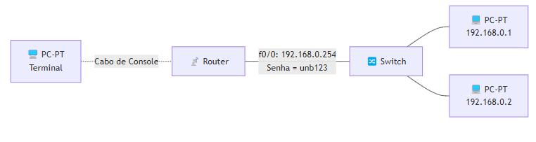

- *1 roteador* - Cisco IOL L3
- *1 switch Ethernet* - Cisco IOL L2 IRON
- *1 Terminal* - via NET -> PUTTY
- *2 PCS* - Linux tinycore-6.4
- enlaces Ethernet entre os dispositivos

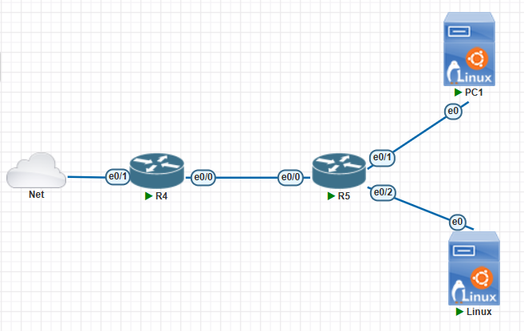

### **Endereçamento IP**

------------------------
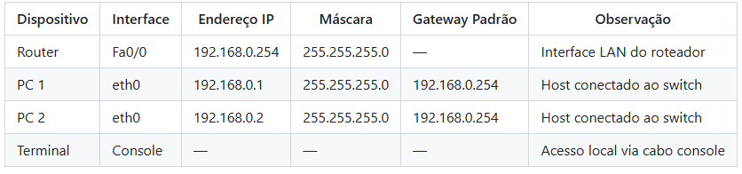

## Configuração do roteador

Primeiro foi feita a configuração inicial e da linha de console:
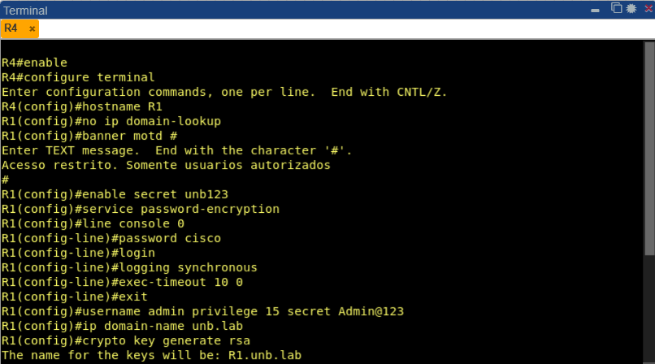

Depois, foi feita a criação de user local e habilitação de SSH:
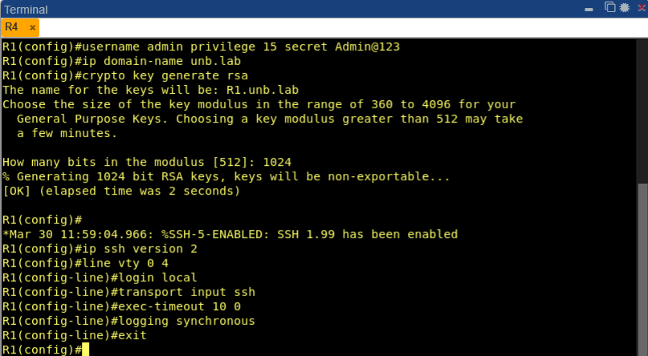

Nesse momento, o PUTTY foi utilizado para testar o acesso a esse roteador, já configurado. No IP address, foi inserido o IP local em que o PNETLab é hospedado, e em Port, foi fornecida a Port Telnet, indicada no próprio PNETLab.

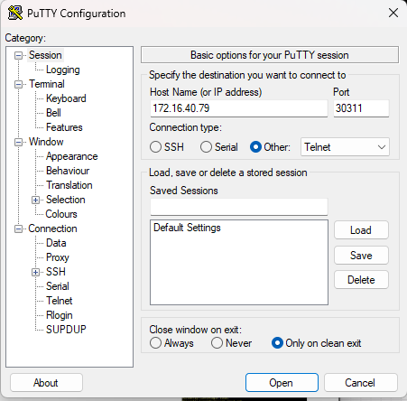

Se o roteador foi bem configurado, devemos ver o terminal do roteador, via PUTTY. E foi exatamente esse o resultado.

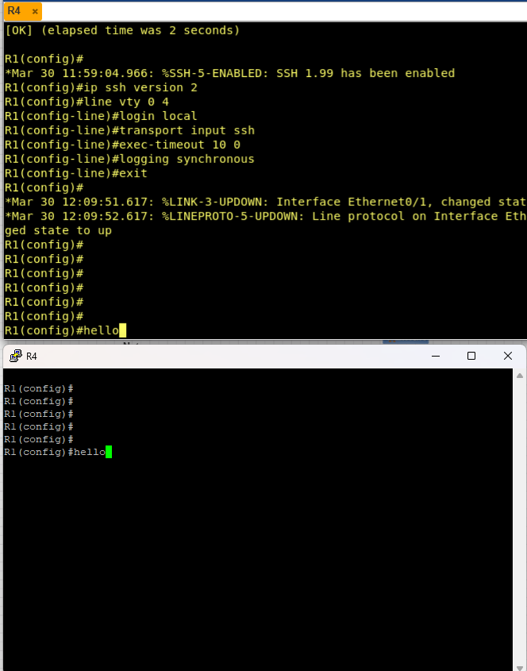

Por fim, a configuração da interface LAN:

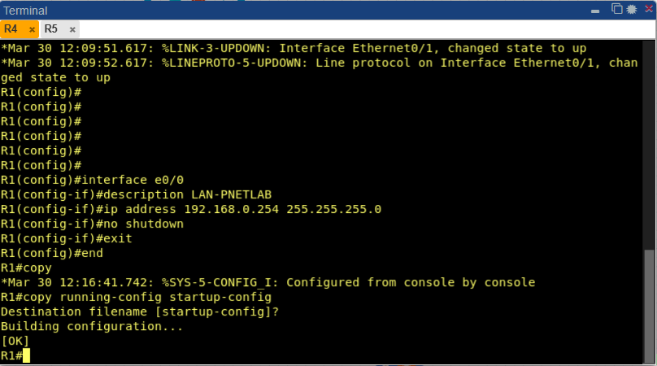

## Configuração dos Hosts Linux

A configuração do IP e gateway dos Hosts foramf feitos conforme a tabela IP, conectados ao gateway correspondente ao IP do roteador, e via GUI, pois o linux tinycore-6.4 permite a interação via interface gráfica:

Host A:
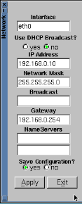

Host B:
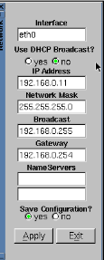

Feito isso, foi testada a conexão do Host A -> roteador, e depois do Host A -> Host B, e esse foi o resultado:

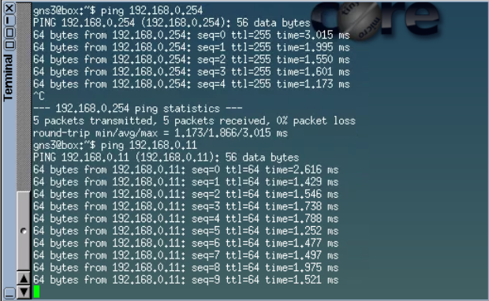

Como pode ser visto, as duas conexões foram bem sucedidas. É 
importante ressaltar que o caminho para Host A se comunicar com 
o Host B é: Host A -> Roteador -> Switch -> Host B, o que 
confirma que a configuração do roteador está perfeitamente 
funcional, e também que o switch está fazendo o encaminhamento 
corretamente.

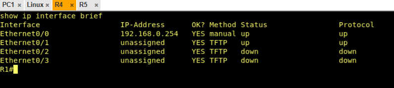

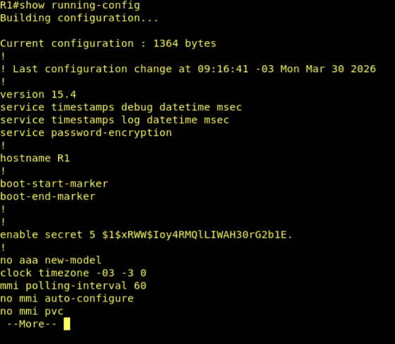

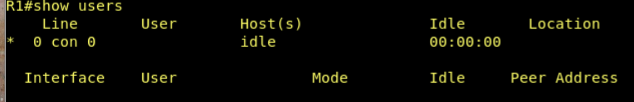

## Conclusão

Este laboratório introduz a configuração básica de roteadores no PNetLab e estabelece as competências mínimas necessárias para os próximos cenários. Dominar CLI, interface IP, acesso remoto e testes de conectividade é essencial antes da evolução para protocolos de roteamento e atividades de diagnóstico mais avançadas.