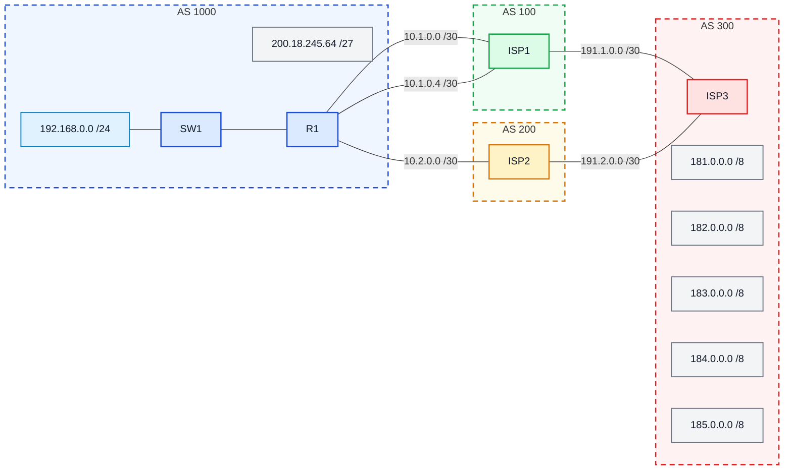

# Laboratório 06 - Roteamento Externo via BGP

## Objetivo
Configurar o protocolo BGP no roteador da empresa para que ela possa anunciar seu prefixo público à Internet por meio de seus provedores.

- compreender o papel do BGP no roteamento entre sistemas autônomos;
- identificar vizinhanças eBGP;
- configurar o BGP em um roteador de borda corporativo;
- anunciar um prefixo público usando o comando network;
- entender o uso de loopback, update-source e ebgp-multihop;
- verificar a tabela de rotas e a tabela BGP.

## Topologia

O cenário representa um pequeno trecho do núcleo operacional da Internet, com três provedores e uma empresa que precisa anunciar o bloco público 200.18.245.64/27. BGP é um protocolo de roteamento interdomínios, usado entre sistemas autônomos (AS).

- a empresa pertence ao AS 1000;
- o ISP1 pertence ao AS 100;
- o ISP2 pertence ao AS 200;
- a senha das vizinhanças é SENHA.



- a empresa anuncia o bloco 200.18.245.64/27;
- o vizinho do ISP1 deve ser estabelecido com a loopback 10.10.10.10/32;
- a empresa deve usar a loopback 11.11.11.11/32 como origem da sessão com o ISP1;
- a vizinhança com o ISP2 será feita pelos endereços reais das interfaces diretamente conectadas.


- a empresa anuncia o bloco 200.18.245.64/27;
- o vizinho do ISP1 deve ser estabelecido com a loopback 10.10.10.10/32;
- a empresa deve usar a loopback 11.11.11.11/32 como origem da sessão com o ISP1;
- a vizinhança com o ISP2 será feita pelos endereços reais das interfaces diretamente conectadas.

# Configuração básica

## Configuração básica das Interfaces em R1


## Configuração do BGP em R1


## Configuração em ISP1


## Configuração em ISP2


## Configuração em ISP3

```
ISP3> enable
ISP3# configure terminal
ISP3(config)# hostname ISP3
ISP3(config)# no ip domain lookup

# Interface para ISP1
ISP3(config)# interface e0/0
ISP3(config-if)# ip address 191.1.0.2 255.255.255.252
ISP3(config-if)# no shut

# Interface para ISP2
ISP3(config-if)# interface e0/1
ISP3(config-if)# ip address 191.2.0.2 255.255.255.252
ISP3(config-if)# no shut

# BGP
ISP3(config-if)# exit
ISP3(config)# router bgp 300
ISP3(config-router)# neighbor 191.1.0.1 remote-as 100
ISP3(config-router)# neighbor 191.1.0.1 password SENHA
ISP3(config-router)# neighbor 191.2.0.1 remote-as 200
ISP3(config-router)# neighbor 191.2.0.1 password SENHA

# Anunciar os prefixos da "Internet"
ISP3(config-router)# network 181.0.0.0 mask 255.0.0.0
ISP3(config-router)# network 182.0.0.0 mask 255.0.0.0
ISP3(config-router)# network 183.0.0.0 mask 255.0.0.0
ISP3(config-router)# network 184.0.0.0 mask 255.0.0.0
ISP3(config-router)# network 185.0.0.0 mask 255.0.0.0
ISP3(config-router)# exit

# Rotas estáticas Null0 para os prefixos anunciados
ISP3(config)# ip route 181.0.0.0 255.0.0.0 Null0
ISP3(config)# ip route 182.0.0.0 255.0.0.0 Null0
ISP3(config)# ip route 183.0.0.0 255.0.0.0 Null0
ISP3(config)# ip route 184.0.0.0 255.0.0.0 Null0
ISP3(config)# ip route 185.0.0.0 255.0.0.0 Null0
ISP3(config)# end
```
## Explicação
- primeiro o BGP foi inicializado no AS 1000;
- depois foi configurada a vizinhança com o ISP1 usando endereços de loopback;
- por isso foi necessário usar:
-- update-source Loopback1
-- ebgp-multihop 2
-- duas rotas estáticas para alcançar 10.10.10.10/32;
- em seguida foi configurada a vizinhança com o ISP2, desta vez usando o endereço real da interface;
- por fim, foi anunciado o prefixo público da empresa com:
-- network 200.18.245.64 mask 255.255.255.224

# Verificação


## Problema identificado e solução:


Durante a verificação inicial, a vizinhança BGP com o ISP1 (10.10.10.10) permanecia no estado Idle enquanto a vizinhança com o ISP2 funcionava corretamente. Testes de conectividade revelaram que o comando ping 10.10.10.10 source 11.11.11.11 falhava (success rate 0%), apesar da conectividade física entre R1 e ISP1 estar operacional. O problema foi identificado nas rotas estáticas configuradas apenas com interface de saída (ex: ip route 10.10.10.10 255.255.255.255 Ethernet0/1), que em redes Ethernet não permitem resolução ARP adequada. A solução consistiu em reconfigurar as rotas especificando o next-hop IP (ex: ip route 10.10.10.10 255.255.255.255 10.1.0.2), permitindo que o roteador identificasse corretamente o próximo salto, estabelecesse as sessões BGP via loopback, e a vizinhança mudasse para o estado Established.

Verificação:
Router# show ip route


- Tabela de rotas contém a rota estática para 10.10.10.10/32;

Router# show ip bgp


- Prefixo 200.18.245.64/27 aparece sendo anunciado;

Router# show ip bgp summary


- Tabela BGP mostra rotas aprendidas dos provedores;

- Rota para 200.18.245.64/27 foi criada com Null0 para permitir o anúncio do prefixo sumarizado.

Router# show run


- Vizinhanças BGP foram estabelecidas;

# Questões para análise
**1- Qual é a função do BGP nesse cenário?**

Anunciar o prefixo público da empresa (200.18.245.64/27) para a Internet através dos provedores ISP1 e ISP2, e aprender rotas externas vindas desses provedores.

**2- Por que a sessão com o ISP1 usa endereço de loopback?**

Para garantir redundância, pois a vizinhança permanece ativa mesmo se um dos dois enlaces físicos entre R1 e ISP1 cair.

**3- Por que foi necessário configurar ebgp-multihop 2?**

Porque a vizinhança eBGP por padrão só funciona com vizinhos diretamente conectados (1 salto), mas as loopbacks não estão diretamente conectadas, exigindo 2 saltos para alcançá-las.

**4- Qual a função do update-source Loopback1?**

Forçar o roteador R1 a usar o IP da Loopback1 (11.11.11.11) como endereço de origem dos pacotes BGP enviados ao ISP1, em vez de usar o IP da interface física de saída.

**5- Por que foi criada a rota ip route 200.18.245.64 255.255.255.224 Null0?**

Para que o prefixo 200.18.245.64/27 exista na tabela de rotas do R1, permitindo que ele seja anunciado via BGP com o comando network, mesmo sem haver hosts reais nessa rede.

**6- Qual a diferença entre o pareamento com o ISP1 e com o ISP2?**

ISP1 usa vizinhança via loopback com redundância de dois enlaces físicos (exigindo ebgp-multihop e update-source), enquanto ISP2 usa vizinhança direta pela interface física sem configurações adicionais.
