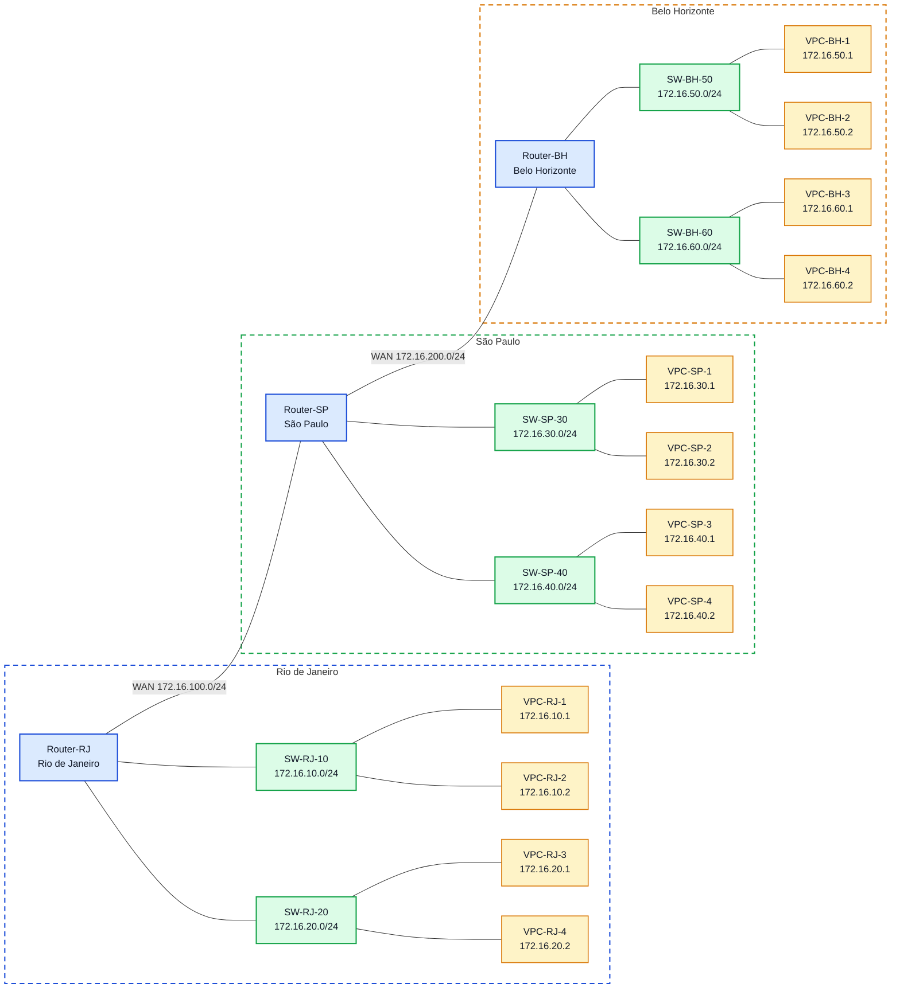

# Laboratório 05 - Roteamento Dinâmico com RIP e OSPF
## Objetivos
- Configurar interfaces IP em roteadores Cisco;
- Ativar roteamento dinâmico com RIP;
- Ativar roteamento dinâmico com OSPF;
- Verificar tabelas de roteamento;
- Validar conectividade entre redes remotas;
- Comparar as características básicas de RIP e OSPF.

# Topologia
A topologia possui três roteadores interligando três unidades:

Router-RJ - Rio de Janeiro
Router-SP - São Paulo
Router-BH - Belo Horizonte
Cada unidade possui duas LANs locais, e os roteadores são interligados por duas redes WAN.

# Configuração
## Hosts

O endereço ip foi feito para os PCs, seguindo esse modelo, que está exmplificando o PC-BH-60-2

IP ROUTE BH:
## Routers
Após isso, foi configuado cada um dos roteadores (RJ, SP, BH):
Exemplo configuração router-rj:

EXEMPLO ROUTER BH:
Importante: O roteiro original especifica interfaces GigabitEthernet (g0/0, g0/1) e FastEthernet (f0/0, f0/1) para os roteadores. Entretanto, o modelo de roteador disponível no PNetLab possui apenas interfaces Ethernet genéricas (e0/0 a e0/3).

## Verificação inicial sem roteamento dinâmico
- conectividade apenas entre redes diretamente conectadas;
- ausência de rotas remotas;
- tabela de rotas contendo apenas rotas conectadas.
SHOW IP ROUTE:

Os outros Routers mostraram resultados similares.

## Configuração do RIP
Como o cenário usa a faixa 172.16.0.0/16, pode-se anunciar a rede maior 172.16.0.0 no processo RIP.
Exemplo configuração RIP no Router-RJ:

## Verificação do RIP
A verficação foi feita em todos os roteadores. A seguir está a verificação do Router-SP, com função de sumarizar.
SHOW IP ROUTE(letra R indica caminho aprendido pelo RIP):

SHOW IP PROTOCOLS(RIP funcionando como esperado:

### Resultado Obtido
- presença de rotas C e L;
- ausência de rotas aprendidas dinamicamente;
- pings bem-sucedidos apenas para redes diretamente conectadas.

## Remoção do RIP
Em cada roteador foi executado:

## Configuração do OSPF

## Verificação do OSPF
Novamente, a verficação foi feita em todos os roteadores. A seguir está a verificação do Router-SP, com função de sumarizar.
SHOW IP OSPF NEIGBOR(mostra vizinhos via OSPF):

SHOW IP ROUTE(Letra "O" indica caminho aprendido por OSPF:

SHOW IP PROTOCOLS(OSPF rodando como esperado - pode ser verificado por Distance = 110, comparado ao RIP que é 120):

### Resultado obtido
- adjacência OSPF formada entre RJ-SP e SP-BH;
- rotas aprendidas com marcação O;
- conectividade total entre todas as LANs.

# Testes
## Teste de alcance 
A partir de um host do Rio de Janeiro, testar conectividade com São Paulo e Belo Horizonte.
A partir do PC-RJ-10-1:

# Comparação orientada entre RIP e OSPF
Após concluir as duas configurações, responder:

1- Qual protocolo foi mais simples de configurar?
2.Qual protocolo apresentou maior riqueza de informações operacionais?
3. Qual a principal métrica do RIP?
4. Qual algoritmo é usado pelo OSPF?
5. Qual protocolo tende a escalar melhor?
6. Qual protocolo converge melhor em cenários maiores?

