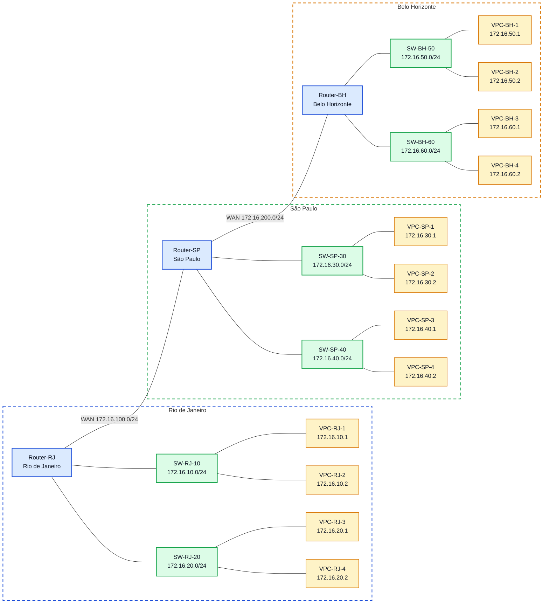

# Laboratório 05 - Roteamento Dinâmico com RIP e OSPF
## Objetivos
- Configurar interfaces IP em roteadores Cisco;
- Ativar roteamento dinâmico com RIP;
- Ativar roteamento dinâmico com OSPF;
- Verificar tabelas de roteamento;
- Validar conectividade entre redes remotas;
- Comparar as características básicas de RIP e OSPF.

## Topologia
A topologia possui três roteadores interligando três unidades:

Router-RJ - Rio de Janeiro
Router-SP - São Paulo
Router-BH - Belo Horizonte
Cada unidade possui duas LANs locais, e os roteadores são interligados por duas redes WAN.

