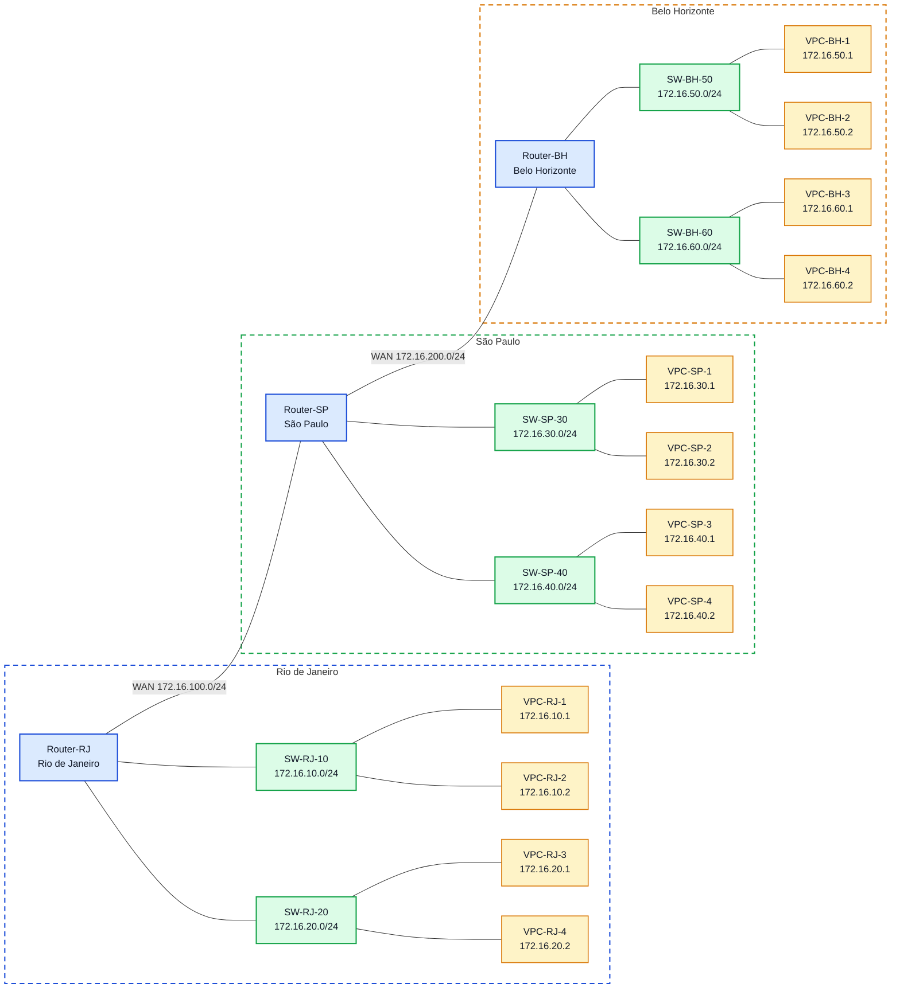

# Laboratório 05 - Roteamento Dinâmico com RIP e OSPF
## Objetivos
- Configurar interfaces IP em roteadores Cisco;
- Ativar roteamento dinâmico com RIP;
- Ativar roteamento dinâmico com OSPF;
- Verificar tabelas de roteamento;
- Validar conectividade entre redes remotas;
- Comparar as características básicas de RIP e OSPF.

# Topologia
A topologia possui três roteadores interligando três unidades:

Router-RJ - Rio de Janeiro
Router-SP - São Paulo
Router-BH - Belo Horizonte
Cada unidade possui duas LANs locais, e os roteadores são interligados por duas redes WAN.

# Configuração
## Hosts

O endereço ip foi feito para os PCs, seguindo esse modelo, que está exmplificando o PC-BH-60-2

IP ROUTE BH:
## Routers
Após isso, foi configuado cada um dos roteadores (RJ, SP, BH):
Exemplo configuração router-rj:

EXEMPLO ROUTER BH:

Importante: O roteiro original especifica interfaces GigabitEthernet (g0/0, g0/1) e FastEthernet (f0/0, f0/1) para os roteadores. Entretanto, o modelo de roteador disponível no PNetLab possui apenas interfaces Ethernet genéricas (e0/0 a e0/3).

## Verificação inicial sem roteamento dinâmico
- conectividade apenas entre redes diretamente conectadas;
- ausência de rotas remotas;
- tabela de rotas contendo apenas rotas conectadas.
SHOW IP ROUTE:

Os outros Routers mostraram resultados similares.

## Configuração do RIP
Como o cenário usa a faixa 172.16.0.0/16, pode-se anunciar a rede maior 172.16.0.0 no processo RIP.
Exemplo configuração RIP no Router-RJ:

## Verificação do RIP
A verficação foi feita em todos os roteadores. A seguir está a verificação do Router-SP, com função de sumarizar.
SHOW IP ROUTE(letra R indica caminho aprendido pelo RIP):

SHOW IP PROTOCOLS(RIP funcionando como esperado:

### Resultado Obtido
- presença de rotas C e L;
- ausência de rotas aprendidas dinamicamente;
- pings bem-sucedidos apenas para redes diretamente conectadas.

## Remoção do RIP
Em cada roteador foi executado:

## Configuração do OSPF

## Verificação do OSPF
Novamente, a verficação foi feita em todos os roteadores. A seguir está a verificação do Router-SP, com função de sumarizar.

PING VPC-SP com as outras máquinas:

SHOW IP OSPF NEIGBOR(mostra vizinhos via OSPF):

SHOW IP ROUTE(Letra "O" indica caminho aprendido por OSPF:

SHOW IP PROTOCOLS(OSPF rodando como esperado - pode ser verificado por Distance = 110, comparado ao RIP que é 120):

### Resultado obtido
- adjacência OSPF formada entre RJ-SP e SP-BH;
- rotas aprendidas com marcação O;
- conectividade total entre todas as LANs.

# Testes
## Teste de alcance 
A partir de um host do Rio de Janeiro, testar conectividade com São Paulo e Belo Horizonte.

A partir do PC-RJ-10-1:

# Comparação orientada entre RIP e OSPF
Após concluir as duas configurações, responder:

## 1. Qual protocolo foi mais simples de configurar?
O RIP é mais simples de configurar, e isso é intencional, pois ele foi projetado para redes pequenas, diferentemente do OSPF, o qual é adequado para redes mais complexas.
## 2. Qual protocolo apresentou maior riqueza de informações operacionais?
O OSPF. Ele fornece comandos de diagnóstico muito mais detalhados:

**show ip ospf neighbor** mostra adjacências, estados, Dead Time, prioridades

**show ip ospf interface** detalha custos, tipos de rede, DR/BDR

**show ip ospf database** expõe a topologia completa conhecida (LSAs)

O RIP basicamente só oferece **show ip protocols** e **show ip route**, com informações limitadas sobre contagem de saltos e timers. 

Essa diferença reflete a natureza dos protocolos: OSPF é link-state (cada roteador tem visão completa da topologia), enquanto RIP é distance-vector (cada roteador só conhece direção e distância, sem mapa topológico).
## 3. Qual a principal métrica do RIP?
O RIP escolhe rotas contando quantos roteadores o pacote precisa atravessar. Uma rede a 1 salto é preferida sobre uma a 2 saltos, independentemente da largura de banda, latência ou confiabilidade dos enlaces. Tem também um limite máximo de 15 saltos. Essa métrica simples é a maior limitação do RIP, porque ele pode escolher um caminho lento com 2 saltos em vez de um caminho rápido com 3 saltos.
## 5. Qual algoritmo é usado pelo OSPF?
**Dijkstra**
Cada roteador OSPF constrói um mapa completo da topologia e então executa o algoritmo de Dijkstra para calcular a árvore de caminhos mais curtos com ele mesmo como raiz. O "custo" de cada caminho é a soma dos custos das interfaces atravessadas, onde custo = 10^8 / largura de banda (em bps). Por exemplo, GigabitEthernet tem custo 1, FastEthernet tem custo 10. 
## 6. Qual protocolo tende a escalar melhor?
OSPF, pois ele não tem limite de saltos, su
porta hierarquia com áreas ( nesse experimento só foi usada a área 0, por ser introdutório), e tem rápida convergência.
## 7. Qual protocolo converge melhor em cenários maiores?
OSPF, como dito na última questão, tem uma rápida convergência. 

RIP: convergência lenta porque:

- Depende de propagação hop-by-hop (cada roteador espera receber atualização do vizinho)
- Updates periódicos a cada 30 segundos (não é sob demanda)
- Problemas como "counting to infinity" podem atrasar convergência

OSPF: convergência rápida porque:

- Detecta falhas via Hello packets (Dead Interval padrão = 40s, mas configurável para 1s)
- Propaga mudanças imediatamente via LSAs triggered updates (não espera timer)
- Cada roteador calcula independentemente (não depende de propagação sequencial)
- Em redes bem projetadas com áreas, mudanças em uma área não afetam outras

# Troubleshooting

## Situação 1 – Remover uma rede do anúncio OSPF em São Paulo
NO NETWORK:

UNREACHABLE(perda de rota para a rede 172.16.40.0/24):

## Situação 2 – Interromper o enlace SP-BH
SHUTDOWN:

UNREACHABLE(perda de rota para BH - o teste foi feito de um PC do RJ pra um de BH):

## Situação 3 – Remover o RIP de um roteador

SHOW IP ROUTE:

A remoção do RIP via no router rip não gerou nenhum impacto, pois o protocolo já havia sido desativado anteriormente quando foi substituído pelo OSPF. Atualmente, toda a topologia opera somente com OSPF, pois ele é mais confiável (medido pela Distance = 110, comparado a Distance = 120 do RIP)
