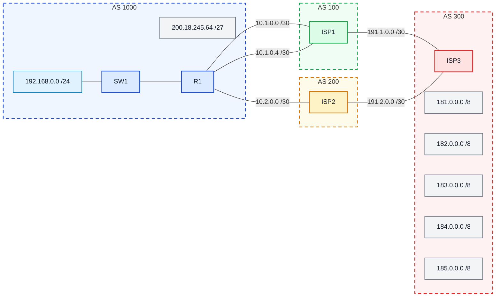

# Laboratório 07 - Configuração dos Provedores (BGP Externo)

**Observação:** Este laboratório é continuação do **Laboratório 06**

## Objetivo

Configurar os roteadores **ISP1**, **ISP2** e **ISP3** para permitir o funcionamento completo do cenário de **BGP externo**.

## Premissas do cenário

### Diagrama lógico 



Considerando a topologia do laboratório 06:

- **R1** pertence ao **AS 1000**
- **ISP1** pertence ao **AS 100**
- **ISP2** pertence ao **AS 200**
- **ISP3** pertence ao **AS 300**

Os enlaces considerados são:

- **R1 ↔ ISP1**
  - rede **10.1.0.0/30**
  - rede **10.1.0.4/30**

- **R1 ↔ ISP2**
  - rede **10.2.0.0/30**

- **ISP1 ↔ ISP3**
  - rede **191.1.0.0/30**

- **ISP2 ↔ ISP3**
  - rede **191.2.0.0/30**

Também será utilizada a loopback:

- **ISP1:** `10.10.10.10/32`

E os prefixos externos anunciados por **ISP3**:

- `181.0.0.0/8`
- `182.0.0.0/8`
- `183.0.0.0/8`
- `184.0.0.0/8`
- `185.0.0.0/8`

---

## 3. Configuração do ISP3

Configure primeiro o **ISP3**, pois ele representa a rede externa com os prefixos de teste.

```bash
ISP3> enable
ISP3# configure terminal
ISP3(config)# no ip domain lookup
ISP3(config)# interface g0/0
ISP3(config-if)# ip address 191.1.0.2 255.255.255.252
ISP3(config-if)# no shut
ISP3(config-if)# interface g0/1
ISP3(config-if)# ip address 191.2.0.2 255.255.255.252
ISP3(config-if)# no shut
ISP3(config-if)# interface loopback 1
ISP3(config-if)# ip address 181.0.0.1 255.0.0.0
ISP3(config-if)# interface loopback 2
ISP3(config-if)# ip address 182.0.0.1 255.0.0.0
ISP3(config-if)# interface loopback 3
ISP3(config-if)# ip address 183.0.0.1 255.0.0.0
ISP3(config-if)# interface loopback 4
ISP3(config-if)# ip address 184.0.0.1 255.0.0.0
ISP3(config-if)# interface loopback 5
ISP3(config-if)# ip address 185.0.0.1 255.0.0.0
ISP3(config-if)# end
```

### BGP no ISP3

```bash
ISP3> enable

ISP3# configure terminal

ISP3(config)# router bgp 300

ISP3(config-router)# neighbor 191.1.0.1 remote-as 100

ISP3(config-router)# neighbor 191.1.0.1 password SENHA

ISP3(config-router)# neighbor 191.2.0.1 remote-as 200

ISP3(config-router)# neighbor 191.2.0.1 password SENHA

ISP3(config-router)# network 181.0.0.0 mask 255.0.0.0

ISP3(config-router)# network 182.0.0.0 mask 255.0.0.0

ISP3(config-router)# network 183.0.0.0 mask 255.0.0.0

ISP3(config-router)# network 184.0.0.0 mask 255.0.0.0

ISP3(config-router)# network 185.0.0.0 mask 255.0.0.0

ISP3(config-router)# end
```

---

## Configuração do ISP1

O **ISP1** possui dois enlaces físicos com o **R1**, além de uma loopback usada como vizinho BGP.

### Interfaces do ISP1

```bash
ISP1> enable
ISP1# configure terminal
ISP1(config)# no ip domain lookup
ISP1(config)# interface loopback 0
ISP1(config-if)# ip address 10.10.10.10 255.255.255.255
ISP1(config-if)# no shut
ISP1(config-if)# interface g0/0
ISP1(config-if)# ip address 10.1.0.2 255.255.255.252
ISP1(config-if)# no shut
ISP1(config-if)# interface g0/1
ISP1(config-if)# ip address 10.1.0.6 255.255.255.252
ISP1(config-if)# no shut
ISP1(config-if)# interface g0/2
ISP1(config-if)# ip address 191.1.0.1 255.255.255.252
ISP1(config-if)# no shut
ISP1(config-if)# end
```

### BGP no ISP1

```bash
ISP1> enable
ISP1# configure terminal
ISP1(config)# router bgp 100
ISP1(config-router)# neighbor 11.11.11.11 remote-as 1000
ISP1(config-router)# neighbor 11.11.11.11 password SENHA
ISP1(config-router)# neighbor 11.11.11.11 ebgp-multihop 2
ISP1(config-router)# neighbor 11.11.11.11 update-source Loopback0
ISP1(config-router)# neighbor 191.1.0.2 remote-as 300
ISP1(config-router)# neighbor 191.1.0.2 password SENHA
ISP1(config-router)# network 10.10.10.10 mask 255.255.255.255
ISP1(config-router)# exit
ISP1(config)# ip route 11.11.11.11 255.255.255.255 Ethernet0/0
ISP1(config)# ip route 11.11.11.11 255.255.255.255 Ethernet0/1
ISP1(config)# end
```

---

## Configuração do ISP2

O **ISP2** possui um enlace direto com o **R1** e um enlace com o **ISP3**.

### Interfaces do ISP2

```bash
ISP2> enable
ISP2# configure terminal
ISP2(config)# no ip domain lookup
ISP2(config)# interface g0/0
ISP2(config-if)# ip address 10.2.0.2 255.255.255.252
ISP2(config-if)# no shut
ISP2(config-if)# interface g0/1
ISP2(config-if)# ip address 191.2.0.1 255.255.255.252
ISP2(config-if)# no shut
ISP2(config-if)# end
```

### BGP no ISP2

```bash
ISP2> enable

ISP2# configure terminal

ISP2(config)# router bgp 200

ISP2(config-router)# neighbor 10.2.0.1 remote-as 1000

ISP2(config-router)# neighbor 10.2.0.1 password SENHA

ISP2(config-router)# neighbor 191.2.0.2 remote-as 300

ISP2(config-router)# neighbor 191.2.0.2 password SENHA

ISP2(config-router)# end
```

---


## Verificação

Após concluir as configurações:

```bash
Router# show ip bgp summary

Router# show ip bgp

Router# show ip route
```
### ISP1


---

show ip bgp summary: Vizinhanças com R1 (11.11.11.11) e ISP3 (191.1.0.2) = Established (números 6 e 6)

show ip bgp: Todas as rotas aparecem, inclusive mostrando múltiplos caminhos para as redes 181-185.x:


* via 11.11.11.11 (vindo do R1)

*> via 191.1.0.2 (vindo do ISP3 — caminho escolhido)

Aparece também via R1→ISP2→ISP3 (path 1000 200 300)

### ISP2


---

show ip route: Rotas BGP (181-185.x e 200.18.245.64/27) marcadas com B ✅

show ip bgp summary: Vizinhanças com R1 (10.2.0.1) e ISP3 (191.2.0.2) = Established (números 1 e 6)

show ip bgp: Recebendo rotas do ISP3 e da empresa ✅

### ISP3


---

show ip bgp summary: Vizinhanças com R1 (11.11.11.11) e ISP3 (191.1.0.2) = Established (números 6 e 6)

show ip bgp: Todas as rotas aparecem, inclusive mostrando múltiplos caminhos para as redes 181-185.x:


* via 11.11.11.11 (vindo do R1)
* 
*> via 191.1.0.2 (vindo do ISP3 — caminho escolhido)
  
Aparece também via R1→ISP2→ISP3 (path 1000 200 300)


---

## Cenário final:

Ao final, o cenário apresenta:

- sessão BGP entre **R1 e ISP1** em estado **Established**
- sessão BGP entre **R1 e ISP2** em estado **Established**
- sessão BGP entre **ISP1 e ISP3** em estado **Established**
- sessão BGP entre **ISP2 e ISP3** em estado **Established**

No **R1**:
### PROBLEMA ENCONTRADO:


A vizinhança BGP com ISP1 inicialmente permaneceu em estado Active devido a rotas estáticas duplicadas no ISP1: duas rotas corretas com next-hop IP (10.1.0.1 e 10.1.0.5) e duas rotas incorretas especificando apenas interface de saída (Ethernet0/0 e Ethernet0/1), causando falha na conectividade entre loopbacks.
A solução consistiu em remover as rotas estáticas configuradas apenas com interface de saída (no ip route 11.11.11.11 255.255.255.255 Ethernet0/0 e no ip route 11.11.11.11 255.255.255.255 Ethernet0/1), mantendo apenas as rotas com next-hop IP explícito.


Após a correção, o ping entre loopbacks passou a funcionar (success rate 100%) e a vizinhança BGP convergiu para o estado Established, permitindo a troca de prefixos entre R1 e ISP1.
Este problema reforça a importância de usar next-hop IP em rotas estáticas sobre redes Ethernet, conforme já observado no Lab 6.


**show ip bgp summary:** em R1:


Mostra as duas vizinhanças (ISP1 e ISP2) em estado Established com números de prefixos recebidos.

**show ip bgp:** em R1:


Mostra todas as rotas aprendidas (181-185.x via ambos os ISPs) e o prefixo da empresa sendo anunciado.

**show ip route bgp:** em R1:


Mostra as rotas com marcação B instaladas na tabela, comprovando o multipath funcionando.

**show running-config | section bgp:** em R1:


Mostra a configuração BGP completa: AS 1000, vizinhanças, network statements, multipath.

**show ip bgp | include 200.18.245.64** em ISP3:
Mostra que o prefixo da empresa chegou até o backbone (AS 300), demonstrando que o anúncio BGP funcionou ponta-a-ponta.


Como pode ser visto, aparecem rotas para:
- `181.0.0.0/8`
- `182.0.0.0/8`
- `183.0.0.0/8`
- `184.0.0.0/8`
- `185.0.0.0/8`

Nos provedores, aparece o prefixo da empresa:

- `200.18.245.64/27`

Observação sobre testes de conectividade fim-a-fim: Durante os testes adicionais, foram observados comportamentos inconsistentes de ping entre loopbacks distantes (R1 ↔ ISP3), apesar de todas as vizinhanças BGP estarem em estado Established, das rotas serem corretamente aprendidas e propagadas, e da conectividade entre nós adjacentes funcionar normalmente. Investigação extensiva apontou para possíveis limitações do emulador PNetLab no encaminhamento de pacotes em cenários BGP com múltiplos saltos e multipath habilitado.
