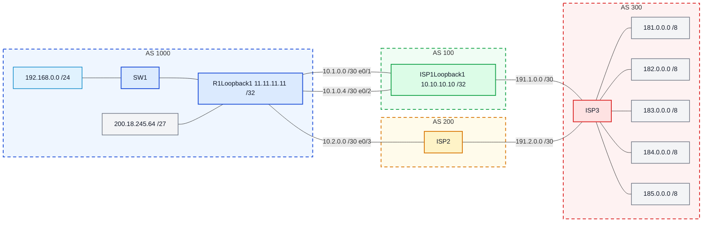

# Laboratório 08 - Políticas BGP e Integração com OSPF

**Disciplina:** ENE0025 - Protocolos de Transporte e Roteamento
**Professor responsável:** Prof. Dr. Laerte Peotta de Melo
**Monitores:** Victor Lima dos Santos / Beatriz Silva Nascimento

**Observação:** Este laboratório é continuação do **Laboratório 07**.

---

## Objetivo

Aplicar **políticas de roteamento BGP** e integrar o **BGP** ao **OSPF** sobre o cenário do Lab 07, realizando:

- anúncio do prefixo público da empresa (`200.18.245.64/27`)
- preferência de saída via **ISP1** (caminho principal) e **ISP2** como contingência (atributo `weight`)
- **OSPF** representando o domínio interno do **AS 1000**
- propagação controlada de apenas a **rota default** do BGP para o OSPF (`default-information originate`)
- análise de redundância entre provedores

---

## Premissas do cenário

### Diagrama lógico



### Cabeamento

| Enlace        | Rede           | Interface R1 | Interface ISP |
|---------------|----------------|--------------|---------------|
| R1 ↔ SW1      | 192.168.0.0/24 | e0/0         | e0/0          |
| R1 ↔ ISP1 (1) | 10.1.0.0/30    | e0/1         | e0/0          |
| R1 ↔ ISP1 (2) | 10.1.0.4/30    | e0/2         | e0/1          |
| R1 ↔ ISP2     | 10.2.0.0/30    | e0/3         | e0/0          |
| ISP1 ↔ ISP3   | 191.1.0.0/30   | —            | e0/2 ↔ e0/0   |
| ISP2 ↔ ISP3   | 191.2.0.0/30   | —            | e0/1 ↔ e0/1   |

### ASNs e loopbacks

| Roteador | ASN  | Loopback         |
|----------|------|------------------|
| R1       | 1000 | 11.11.11.11/32   |
| ISP1     | 100  | 10.10.10.10/32   |
| ISP2     | 200  | —                |
| ISP3     | 300  | 181-185.0.0.1/8  |

---

## Etapa 1 — Configuração do OSPF interno no R1

O OSPF representa o domínio interno da empresa (LAN + loopback do R1).

```bash
R1> enable
R1# configure terminal
R1(config)# router ospf 10
R1(config-router)# router-id 11.11.11.11
R1(config-router)# network 192.168.0.0 0.0.0.255 area 0
R1(config-router)# network 11.11.11.11 0.0.0.0 area 0
R1(config-router)# end
```

---

## Etapa 2 — Configuração do BGP no R1

Sessões eBGP para **ISP1** (via loopback, com `ebgp-multihop`) e **ISP2** (vizinho direto). Inclui o `network` do bloco público e a rota Null0 que o BGP exige para originar a rede.

```bash
R1(config)# ip route 10.10.10.10 255.255.255.255 10.1.0.2
R1(config)# ip route 10.10.10.10 255.255.255.255 10.1.0.6
R1(config)# ip route 200.18.245.64 255.255.255.224 Null0

R1(config)# router bgp 1000
R1(config-router)# bgp router-id 11.11.11.11
R1(config-router)# neighbor 10.10.10.10 remote-as 100
R1(config-router)# neighbor 10.10.10.10 password SENHA
R1(config-router)# neighbor 10.10.10.10 ebgp-multihop 2
R1(config-router)# neighbor 10.10.10.10 update-source Loopback1
R1(config-router)# neighbor 10.2.0.2 remote-as 200
R1(config-router)# neighbor 10.2.0.2 password SENHA
R1(config-router)# network 200.18.245.64 mask 255.255.255.224
R1(config-router)# end
```

> O lab original usa `Serial2/0` nas estáticas — como o cenário no PNetLab está em **Ethernet**, foi usado **next-hop IP**, alinhando com a lição do Lab 07 (rotas estáticas sobre Ethernet devem ter next-hop IP).

---

## Etapa 3 — Política BGP: ISP1 principal, ISP2 backup

O atributo **`weight`** é local ao roteador Cisco e é o **primeiro** critério do BGP best-path. Atribuir `weight 200` ao vizinho ISP1 e `weight 100` ao vizinho ISP2 faz com que **todas** as rotas via ISP1 venham preferidas, independentemente do AS-PATH.

```bash
R1(config)# router bgp 1000
R1(config-router)# neighbor 10.10.10.10 weight 200
R1(config-router)# neighbor 10.2.0.2 weight 100
R1(config-router)# end
```

---

## Etapa 4 — Integração BGP × OSPF (apenas rota default)

Em vez de redistribuir os 5 prefixos externos no OSPF (poluindo o domínio interno), apenas a **rota default** é propagada. O `default-information originate` injeta uma LSA Type-5 anunciando `0.0.0.0/0` no OSPF.

```bash
R1(config)# ip route 0.0.0.0 0.0.0.0 10.10.10.10
R1(config)# router ospf 10
R1(config-router)# default-information originate
R1(config-router)# end
```

A default aponta recursivamente para `10.10.10.10` (loopback do ISP1); enquanto qualquer um dos dois enlaces físicos com o ISP1 estiver UP, a recursão resolve e a default fica viva.

---

## Verificação

Após concluir as configurações, executamos os comandos de verificação em cada roteador.

### R1

#### `show ip bgp summary` em R1

```
BGP router identifier 11.11.11.11, local AS number 1000
BGP table version is 8, main routing table version 8
7 network entries using 980 bytes of memory
13 path entries using 1040 bytes of memory

Neighbor        V           AS MsgRcvd MsgSent   TblVer  InQ OutQ Up/Down  State/PfxRcd
10.2.0.2        4          200      16      14        8    0    0 00:07:32        6
10.10.10.10     4          100      16      14        8    0    0 00:07:41        6
```

Mostra as duas vizinhanças (ISP1 via loopback `10.10.10.10` e ISP2 direto `10.2.0.2`) em estado **Established**, ambas com **6 prefixos recebidos** e Up/Down >7 min.

#### `show ip bgp` em R1

```
     Network          Next Hop            Metric LocPrf Weight Path
 r   10.10.10.10/32   10.2.0.2                               0 200 300 100 i
 r>                   10.10.10.10              0             0 100 i
 *   181.0.0.0/8      10.2.0.2                               0 200 300 i
 *>                   10.10.10.10                            0 100 300 i
 *   182.0.0.0/8      10.2.0.2                               0 200 300 i
 *>                   10.10.10.10                            0 100 300 i
 *   183.0.0.0/8      10.2.0.2                               0 200 300 i
 *>                   10.10.10.10                            0 100 300 i
 *   184.0.0.0/8      10.2.0.2                               0 200 300 i
 *>                   10.10.10.10                            0 100 300 i
 *   185.0.0.0/8      10.2.0.2                               0 200 300 i
 *>                   10.10.10.10                            0 100 300 i
 *>  200.18.245.64/27 0.0.0.0                  0         32768 i
```

Todas as rotas aparecem com **dois caminhos**: via ISP1 (AS-PATH `100 300`) e via ISP2 (`200 300`). O `*>` (best) está sempre no caminho via **ISP1**, comprovando a política weight. O prefixo `200.18.245.64/27` aparece originado localmente (`Weight 32768`).

#### `show ip route` em R1

```
Gateway of last resort is 10.10.10.10 to network 0.0.0.0

S*    0.0.0.0/0 [1/0] via 10.10.10.10
      10.0.0.0/8 is variably subnetted, 7 subnets, 2 masks
C        10.1.0.0/30 is directly connected, Ethernet0/1
L        10.1.0.1/32 is directly connected, Ethernet0/1
C        10.1.0.4/30 is directly connected, Ethernet0/2
L        10.1.0.5/32 is directly connected, Ethernet0/2
C        10.2.0.0/30 is directly connected, Ethernet0/3
L        10.2.0.1/32 is directly connected, Ethernet0/3
S        10.10.10.10/32 [1/0] via 10.1.0.6
                        [1/0] via 10.1.0.2
      11.0.0.0/32 is subnetted, 1 subnets
C        11.11.11.11 is directly connected, Loopback1
B     181.0.0.0/8 [20/0] via 10.10.10.10, 00:06:55
B     182.0.0.0/8 [20/0] via 10.10.10.10, 00:06:55
B     183.0.0.0/8 [20/0] via 10.10.10.10, 00:06:55
B     184.0.0.0/8 [20/0] via 10.10.10.10, 00:06:55
B     185.0.0.0/8 [20/0] via 10.10.10.10, 00:06:55
      192.168.0.0/24 is variably subnetted, 2 subnets, 2 masks
C        192.168.0.0/24 is directly connected, Ethernet0/0
L        192.168.0.1/32 is directly connected, Ethernet0/0
      200.18.245.0/27 is subnetted, 1 subnets
S        200.18.245.64 is directly connected, Null0
```

Confirma:

- `S* 0.0.0.0/0 via 10.10.10.10` — default route ativa.
- `S 10.10.10.10/32` com **dois next-hops** (`10.1.0.2` e `10.1.0.6`) — redundância L3 entre os dois enlaces físicos com o ISP1.
- 5 prefixos `B` (BGP) todos via `10.10.10.10` — política weight aplicada.
- `S 200.18.245.64 ... Null0` — rota dummy que sustenta o `network` no BGP.

#### `show ip ospf database` em R1

```
            OSPF Router with ID (11.11.11.11) (Process ID 10)

		Router Link States (Area 0)

Link ID         ADV Router      Age         Seq#       Checksum Link count
11.11.11.11     11.11.11.11     443         0x80000003 0x0045E0 2

		Type-5 AS External Link States

Link ID         ADV Router      Age         Seq#       Checksum Tag
0.0.0.0         11.11.11.11     444         0x80000001 0x0092EA 10
```

Apenas **uma LSA Type-5**, com Link ID `0.0.0.0` — a default route. Nenhum prefixo externo foi redistribuído. O domínio interno fica limpo, exatamente como a Etapa 4 propõe.

#### `show ip protocols | section ospf` em R1

```
Routing Protocol is "ospf 10"
  Router ID 11.11.11.11
  It is an autonomous system boundary router
 Redistributing External Routes from,
  Number of areas in this router is 1. 1 normal 0 stub 0 nssa
  Routing for Networks:
    11.11.11.11 0.0.0.0 area 0
    192.168.0.0 0.0.0.255 area 0
```

A linha `It is an autonomous system boundary router` confirma que o R1 virou ASBR (efeito direto do `default-information originate`).

#### `show running-config | section bgp` em R1

```
router bgp 1000
 bgp router-id 11.11.11.11
 bgp log-neighbor-changes
 network 200.18.245.64 mask 255.255.255.224
 neighbor 10.2.0.2 remote-as 200
 neighbor 10.2.0.2 password SENHA
 neighbor 10.2.0.2 weight 100
 neighbor 10.10.10.10 remote-as 100
 neighbor 10.10.10.10 password SENHA
 neighbor 10.10.10.10 ebgp-multihop 2
 neighbor 10.10.10.10 update-source Loopback1
 neighbor 10.10.10.10 weight 200
```

Configuração final do BGP: política weight, sessão multihop por loopback e bloco público anunciado.

---

### ISP1

#### `show ip bgp summary` em ISP1

```
BGP router identifier 1.1.1.1, local AS number 100
Neighbor        V           AS MsgRcvd MsgSent   TblVer  InQ OutQ Up/Down  State/PfxRcd
11.11.11.11     4         1000      15      17        8    0    0 00:08:15        1
191.1.0.2       4          300      16      15        8    0    0 00:10:24        5
```

Sessões com R1 (`11.11.11.11`) e ISP3 (`191.1.0.2`) em **Established**. Recebe **1** prefixo do R1 (`200.18.245.64/27`) e **5** prefixos do ISP3 (`181-185.0.0.0/8`).

#### `show ip bgp` em ISP1

```
     Network          Next Hop            Metric LocPrf Weight Path
 *>   10.10.10.10/32   0.0.0.0                  0         32768 i
 *>   181.0.0.0/8      191.1.0.2                0             0 300 i
 *>   182.0.0.0/8      191.1.0.2                0             0 300 i
 *>   183.0.0.0/8      191.1.0.2                0             0 300 i
 *>   184.0.0.0/8      191.1.0.2                0             0 300 i
 *>   185.0.0.0/8      191.1.0.2                0             0 300 i
 *>   200.18.245.64/27 11.11.11.11              0             0 1000 i
```

Origina sua loopback `10.10.10.10/32`, repassa os 5 prefixos do ISP3 e recebe o `/27` do R1.

#### `show ip route` em ISP1

```
      10.0.0.0/8 is variably subnetted, 5 subnets, 2 masks
C        10.1.0.0/30 is directly connected, Ethernet0/0
L        10.1.0.2/32 is directly connected, Ethernet0/0
C        10.1.0.4/30 is directly connected, Ethernet0/1
L        10.1.0.6/32 is directly connected, Ethernet0/1
C        10.10.10.10/32 is directly connected, Loopback1
      11.0.0.0/32 is subnetted, 1 subnets
S        11.11.11.11 [1/0] via 10.1.0.5
                     [1/0] via 10.1.0.1
B     181.0.0.0/8 [20/0] via 191.1.0.2, 00:09:16
B     182.0.0.0/8 [20/0] via 191.1.0.2, 00:09:16
B     183.0.0.0/8 [20/0] via 191.1.0.2, 00:09:16
B     184.0.0.0/8 [20/0] via 191.1.0.2, 00:09:16
B     185.0.0.0/8 [20/0] via 191.1.0.2, 00:09:16
B        200.18.245.64 [20/0] via 11.11.11.11, 00:07:30
```

Rotas BGP (`B`) corretamente instaladas. As estáticas multipath para `11.11.11.11` sustentam a sessão eBGP multihop.

---

### ISP2

#### `show ip bgp summary` em ISP2

```
BGP router identifier 2.2.2.2, local AS number 200
Neighbor        V           AS MsgRcvd MsgSent   TblVer  InQ OutQ Up/Down  State/PfxRcd
10.2.0.1        4         1000      15      17        8    0    0 00:08:08        7
191.2.0.2       4          300      16      14        8    0    0 00:09:46        7
```

Duas sessões eBGP UP. Recebe os 5 prefixos externos via ISP3 + a loopback do ISP1 + o `/27` da empresa.

#### `show ip bgp` em ISP2

```
     Network          Next Hop            Metric LocPrf Weight Path
 *   10.10.10.10/32   10.2.0.1                               0 1000 100 i
 *>                   191.2.0.2                              0 300 100 i
 *   181.0.0.0/8      10.2.0.1                               0 1000 100 300 i
 *>                   191.2.0.2                0             0 300 i
 *   182.0.0.0/8      10.2.0.1                               0 1000 100 300 i
 *>                   191.2.0.2                0             0 300 i
 *   183.0.0.0/8      10.2.0.1                               0 1000 100 300 i
 *>                   191.2.0.2                0             0 300 i
 *   184.0.0.0/8      10.2.0.1                               0 1000 100 300 i
 *>                   191.2.0.2                0             0 300 i
 *   185.0.0.0/8      10.2.0.1                               0 1000 100 300 i
 *>                   191.2.0.2                0             0 300 i
 *   200.18.245.64/27 191.2.0.2                              0 300 100 1000 i
 *>                   10.2.0.1                 0             0 1000 i
```

Vê os prefixos externos por **dois caminhos** (direto via ISP3 ou indireto via R1→ISP1→ISP3) — o caminho direto vence por AS-PATH menor. Para o `/27` da empresa, o caminho direto (`10.2.0.1`) vence.

---

### ISP3

#### `show ip bgp summary` em ISP3

```
BGP router identifier 3.3.3.3, local AS number 300
Neighbor        V           AS MsgRcvd MsgSent   TblVer  InQ OutQ Up/Down  State/PfxRcd
191.1.0.1       4          100      15      16        8    0    0 00:10:24        2
191.2.0.1       4          200      14      16        8    0    0 00:09:45        1
```

Recebe **2** prefixos via ISP1 (`10.10.10.10/32` + `200.18.245.64/27`) e **1** via ISP2 (`200.18.245.64/27`).

#### `show ip bgp` em ISP3

```
     Network          Next Hop            Metric LocPrf Weight Path
 *>  10.10.10.10/32   191.1.0.1                0             0 100 i
 *>  181.0.0.0/8      0.0.0.0                  0         32768 i
 *>  182.0.0.0/8      0.0.0.0                  0         32768 i
 *>  183.0.0.0/8      0.0.0.0                  0         32768 i
 *>  184.0.0.0/8      0.0.0.0                  0         32768 i
 *>  185.0.0.0/8      0.0.0.0                  0         32768 i
 *   200.18.245.64/27 191.2.0.1                              0 200 1000 i
 *>                   191.1.0.1                              0 100 1000 i
```

Origina os 5 prefixos `/8`, recebe a loopback do ISP1 e o `/27` da empresa **por ambos os caminhos** (via ISP1 e via ISP2).

#### `show ip bgp 200.18.245.64 255.255.255.224` em ISP3

```
BGP routing table entry for 200.18.245.64/27, version 8
Paths: (2 available, best #2, table default)
  Refresh Epoch 1
  200 1000
    191.2.0.1 from 191.2.0.1 (2.2.2.2)
      Origin IGP, localpref 100, valid, external
  Refresh Epoch 1
  100 1000
    191.1.0.1 from 191.1.0.1 (1.1.1.1)
      Origin IGP, localpref 100, valid, external, best
```

Comprova o anúncio **ponta-a-ponta** do bloco público: o `200.18.245.64/27` chega ao backbone (AS 300) pelos dois caminhos. AS-PATHs têm o mesmo tamanho (`100 1000` vs `200 1000`), e o desempate fica no **router-id menor** (`1.1.1.1` vence `2.2.2.2`), por isso o ISP3 elege a path via ISP1 como **best**.

---

## Validação da política weight

Resumo do que cada verificação confirma:

| Critério                                | Como verificar               | Resultado                                                       |
|-----------------------------------------|------------------------------|-----------------------------------------------------------------|
| Sessões BGP estabelecidas               | `show ip bgp summary` no R1  | Ambas UP por >7 min, 6 PfxRcd cada                              |
| Prefixo da empresa anunciado            | `show ip bgp` no ISP3        | `200.18.245.64/27` visto via duas paths (ISP1 best)             |
| ISP1 = caminho preferencial             | `show ip bgp` no R1          | Todos os `181-185.0.0.0/8` com `*>` no next-hop `10.10.10.10`   |
| Default route presente                  | `show ip route` no R1        | `S* 0.0.0.0/0 via 10.10.10.10`                                  |
| Default propagada via OSPF              | `show ip ospf database`      | LSA Type-5 com Link ID `0.0.0.0`, R1 = ASBR                     |
| OSPF interno sem poluição de externos   | `show ip ospf database`      | Apenas a Type-5 da default; nenhum dos /8 redistribuído         |
| Conectividade adjacente (loopback ISP1) | `ping 10.10.10.10`           | 100% (5/5)                                                      |

---

## Teste de falha (failover)

Procedimento sugerido (não foi aplicado nesta execução para preservar o cenário em operação):

1. **Estado base:** `show ip route 0.0.0.0` no R1 → next-hop `10.10.10.10`; rotas BGP `B 181..185.0.0.0/8 via 10.10.10.10`.
2. **Derruba 1 enlace do ISP1:** `interface Ethernet0/1; shutdown` no R1. A sessão eBGP com `10.10.10.10` **continua UP** porque a recursão ainda alcança a loopback pelo segundo enlace (`10.1.0.6`). É exatamente para isso que serve a sessão por loopback.
3. **Derruba o 2º enlace do ISP1:** `interface Ethernet0/2; shutdown`. A rota estática para `10.10.10.10/32` morre, a sessão eBGP cai e o BGP escolhe o **ISP2** como best-path em todos os 5 prefixos externos. A default `S* 0.0.0.0/0 via 10.10.10.10` também some, e o OSPF deixa de anunciar a LSA Type-5 — momento em que faz sentido **adicionar uma default secundária** (`ip route 0.0.0.0 0.0.0.0 10.2.0.2 250`) para garantir saída pelo ISP2 mesmo sem a sessão com ISP1.
4. **Restaura:** `no shutdown` nas duas interfaces; após o BGP reconvergir (~poucos segundos), o ISP1 volta a ser preferido por causa do weight.

**O que observar:**

- O atributo `weight` é **local** ao R1 — só afeta a saída do AS 1000.
- O ISP1 continua sendo o caminho enquanto **qualquer** um dos dois enlaces físicos estiver ativo, graças ao multipath estático para a loopback `10.10.10.10`.
- Em queda total do ISP1, o ISP2 assume — mas a default propagada via OSPF é perdida junto, o que motiva a configuração de uma default backup como descrito acima.

---

## Observação sobre testes ICMP fim-a-fim

Durante a validação, foi observado o mesmo comportamento já documentado no Lab 07: ping de `R1` para loopbacks remotas do `ISP3` (ex.: `181.0.0.1`) retorna **0% success**, embora o `traceroute` mostre que o pacote chega corretamente no **ISP1** (hop 1: `10.1.0.2` / `10.1.0.6`) e ali se perde.

```
R1# traceroute 181.0.0.1 source 11.11.11.11 numeric
Tracing the route to 181.0.0.1
  1 10.1.0.2 0 msec
    10.1.0.6 1 msec
    10.1.0.2 0 msec
  2  *  *  *
  3  *  *  *
```

A causa é **rota de retorno**: o `R1` envia com source `11.11.11.11` (sua loopback), mas `11.11.11.11/32` **nunca é anunciada** no BGP externo (apenas o `/27` é). O ISP3 não tem rota de volta. Comportamento esperado dado o desenho do laboratório.

Ping para o **vizinho BGP** (`10.10.10.10`), que **é** anunciado e tem rota de retorno via estáticas multipath no ISP1, funciona com 100% success:

```
R1# ping 10.10.10.10 source 11.11.11.11 repeat 5
Type escape sequence to abort.
Sending 5, 100-byte ICMP Echos to 10.10.10.10, timeout is 2 seconds:
Packet sent with a source address of 11.11.11.11
!!!!!
Success rate is 100 percent (5/5), round-trip min/avg/max = 1/1/1 ms
```

---

## Cenário final

Ao final do laboratório o cenário apresenta:

- sessão BGP entre **R1 e ISP1** (via loopback) em estado **Established**
- sessão BGP entre **R1 e ISP2** em estado **Established**
- sessão BGP entre **ISP1 e ISP3** em estado **Established**
- sessão BGP entre **ISP2 e ISP3** em estado **Established**
- 5 prefixos externos (`181-185.0.0.0/8`) na tabela do R1, todos via ISP1 (política weight)
- bloco público `200.18.245.64/27` anunciado e visto no AS 300 por ambos os caminhos
- LSA Type-5 (default) propagada no OSPF interno, **sem** poluição com os prefixos externos

---

## Respostas às questões da Seção 14 da proposta

1. **Papel do OSPF:** representar o domínio interno do AS 1000 (LAN + loopback), trocando prefixos internos e servindo como veículo para a rota default chegar nos elementos internos.
2. **Papel do BGP:** anunciar/receber prefixos entre sistemas autônomos (AS 1000 ↔ 100 ↔ 200 ↔ 300) e ser o ponto onde a política de saída é aplicada.
3. **Por que `200.18.245.64/27` é anunciado e `192.168.0.0/24` não:** o `/27` é o bloco público alocado à empresa (roteável na Internet); a `192.168.0.0/24` é RFC1918 (não roteável globalmente) — anunciá-la seria contraproducente.
4. **Vantagem de eBGP por loopback com ISP1:** sobrevive à perda de um dos dois enlaces físicos. Enquanto qualquer dos dois estiver ativo, a sessão continua UP.
5. **`update-source Loopback1`:** força o R1 a originar os pacotes BGP com endereço `11.11.11.11`, batendo com o `neighbor 11.11.11.11` configurado no ISP1.
6. **`ebgp-multihop 2`:** permite eBGP entre IPs **não diretamente conectados** (loopback R1 ↔ loopback ISP1) aumentando o TTL inicial para 2.
7. **Como ver qual ISP está preferido:** no `show ip bgp`, o caminho com `>` é o best — neste lab, todos os `181-185.0.0.0/8` mostram `*>` no next-hop `10.10.10.10` (ISP1).
8. **Por que só a default no OSPF:** mantém a LSDB enxuta, evita propagar mudanças da tabela de Internet para o interior e centraliza a política de saída no R1.
9. **Falha do ISP1 principal:** se cai 1 enlace, nada muda. Se caem os 2, a sessão eBGP morre, o ISP2 assume como best-path para todos os prefixos externos e a default original (recursiva via 10.10.10.10) some — daí a recomendação de adicionar uma default backup via ISP2.
10. **Diferença OSPF × BGP:** OSPF é IGP (link-state, dentro do AS) ideal para a rede interna; BGP é EGP (path-vector, entre ASes) e é o protocolo correto para a borda — cada um cumpre seu papel, e a integração entre eles deve ser seletiva.

---

## Conclusão

O laboratório demonstrou na prática como **políticas BGP** e **integração controlada com OSPF** materializam decisões operacionais comuns no mundo real:

- O atributo **`weight`** foi suficiente para implementar a política "ISP1 principal, ISP2 backup" sem nenhuma redistribuição extra.
- Sustentar a sessão eBGP por **loopback** com `ebgp-multihop 2` + multipath estático provou-se resistente à perda de um enlace físico.
- Propagar **apenas a default** para o OSPF mantém o domínio interno simples e centraliza a política no roteador de borda — evitando que prefixos da tabela de Internet sejam injetados no IGP.
- A integração **OSPF × BGP** ficou clara: cada protocolo cumpre o papel para o qual foi desenhado (IGP dentro, EGP fora) e a redistribuição é feita **seletiva e controlada**, não em massa.

As quatro vizinhanças BGP foram observadas em estado **Established**, a política `weight` foi confirmada pelo marcador `*>` em todos os prefixos externos, e a default route foi corretamente propagada no OSPF como uma única LSA Type-5 — completando todos os critérios de avaliação propostos.
