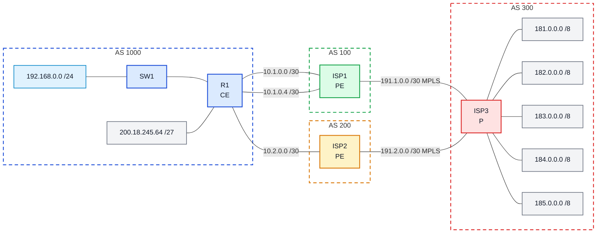

# Laboratório 09 - Implementação de MPLS no Backbone

**Disciplina:** ENE0025 - Protocolos de Transporte e Roteamento
**Professor responsável:** Prof. Dr. Laerte Peotta de Melo
**Monitores:** Victor Lima dos Santos / Beatriz Silva Nascimento

**Observação:** Este laboratório é continuação do **Laboratório 08**.

---

## Objetivo

Implementar um backbone MPLS simplificado no domínio do provedor:

- ativar **OSPF 100** entre ISP1/ISP2/ISP3 como IGP do backbone
- habilitar **MPLS + LDP** apenas nos enlaces internos da operadora
- preservar a infraestrutura do Lab 08 (BGP, OSPF interno do R1, sessões eBGP)
- verificar distribuição de labels e comutação por rótulos no núcleo

---

## Topologia e papéis



| Papel | Roteador | Função |
|-------|----------|--------|
| **CE** | R1 | Cliente; fala IP/BGP, não conhece MPLS |
| **PE** | ISP1, ISP2 | Borda da operadora; entrada/saída da nuvem MPLS |
| **P**  | ISP3 | Núcleo; comuta apenas por rótulo |

---

## Etapa 1 — Loopbacks do backbone

Loopbacks de identificação dos LSRs no OSPF/LDP:

| Roteador | Interface | IP |
|----------|-----------|-----|
| ISP1 | **Loopback10** | 1.1.1.1/32 |
| ISP2 | Loopback1 | 2.2.2.2/32 |
| ISP3 | Loopback10 | 3.3.3.3/32 |

> **Desvio do enunciado:** o lab pedia `Loopback 1` no ISP1 com `1.1.1.1/32`, mas a `Loopback1` já hospeda `10.10.10.10/32` desde o Lab 08 — endereço que sustenta a sessão eBGP multihop com R1. Sobrescrever derrubaria o Lab 08. Usei **Loopback10** no ISP1 para preservar o cenário anterior.

```bash
# ISP1
ISP1(config)# interface Loopback10
ISP1(config-if)# ip address 1.1.1.1 255.255.255.255

# ISP2
ISP2(config)# interface Loopback1
ISP2(config-if)# ip address 2.2.2.2 255.255.255.255

# ISP3
ISP3(config)# interface Loopback10
ISP3(config-if)# ip address 3.3.3.3 255.255.255.255
```

---

## Etapa 2 — OSPF 100 no backbone

Processo OSPF 100 (separado do OSPF 10 interno do R1), todos em area 0:

```bash
# ISP1
ISP1(config)# router ospf 100
ISP1(config-router)# router-id 1.1.1.1
ISP1(config-router)# network 191.1.0.0 0.0.0.3 area 0
ISP1(config-router)# network 1.1.1.1 0.0.0.0 area 0

# ISP2
ISP2(config)# router ospf 100
ISP2(config-router)# router-id 2.2.2.2
ISP2(config-router)# network 191.2.0.0 0.0.0.3 area 0
ISP2(config-router)# network 2.2.2.2 0.0.0.0 area 0

# ISP3
ISP3(config)# router ospf 100
ISP3(config-router)# router-id 3.3.3.3
ISP3(config-router)# network 191.1.0.0 0.0.0.3 area 0
ISP3(config-router)# network 191.2.0.0 0.0.0.3 area 0
ISP3(config-router)# network 3.3.3.3 0.0.0.0 area 0
```

---

## Etapa 3 — MPLS + LDP nos enlaces do backbone

Apenas nos enlaces ISP1↔ISP3 e ISP2↔ISP3. O enunciado usa `fastethernet 0/0`, mas no PNetLab as interfaces são **Ethernet**, com a numeração de cada par:

```bash
# ISP1 (enlace com ISP3)
ISP1(config)# mpls label protocol ldp
ISP1(config)# mpls ldp router-id Loopback10 force
ISP1(config)# interface Ethernet0/2
ISP1(config-if)# mpls ip

# ISP2 (enlace com ISP3)
ISP2(config)# mpls label protocol ldp
ISP2(config)# mpls ldp router-id Loopback1 force
ISP2(config)# interface Ethernet0/1
ISP2(config-if)# mpls ip

# ISP3 (dois enlaces, com ISP1 e ISP2)
ISP3(config)# mpls label protocol ldp
ISP3(config)# mpls ldp router-id Loopback10 force
ISP3(config)# interface Ethernet0/0
ISP3(config-if)# mpls ip
ISP3(config)# interface Ethernet0/1
ISP3(config-if)# mpls ip
```

> **Por que `mpls ldp router-id ... force`:** por padrão, o LDP elege a loopback de maior IP como seu LDP-ID. No ISP1 isso seria `10.10.10.10` (Lab 08) e no ISP3 seria `185.0.0.1`. Nenhuma das duas está anunciada no OSPF do backbone, então as sessões LDP não estabilizariam (LDP-ID precisa ser alcançável via IGP). Forçando para a loopback do backbone (`1.1.1.1`, `2.2.2.2`, `3.3.3.3`), o LDP usa o roteamento OSPF.

---

## Verificação do OSPF (Item 12)

### `show ip ospf neighbor` em ISP3

```
Neighbor ID     Pri   State           Dead Time   Address         Interface
2.2.2.2           1   FULL/BDR        00:00:36    191.2.0.1       Ethernet0/1
1.1.1.1           1   FULL/BDR        00:00:37    191.1.0.1       Ethernet0/0
```

Dois vizinhos em **FULL**. ISP3 é DR nas duas interfaces; ISP1 e ISP2 são BDR. Convergência completa.

### `show ip route` em ISP3 (recorte das rotas OSPF)

```
O   1.1.1.1 [110/11] via 191.1.0.1, Ethernet0/0
O   2.2.2.2 [110/11] via 191.2.0.1, Ethernet0/1
C   3.3.3.3 is directly connected, Loopback10
```

ISP3 aprendeu via OSPF as loopbacks dos PEs — pré-requisito para o LDP distribuir labels.

### `show ip protocols` em ISP3 (seção OSPF)

```
Routing Protocol is "ospf 100"
  Router ID 3.3.3.3
  Routing for Networks:
    3.3.3.3 0.0.0.0 area 0
    191.1.0.0 0.0.0.3 area 0
    191.2.0.0 0.0.0.3 area 0
  Routing Information Sources:
    2.2.2.2  Distance 110
    1.1.1.1  Distance 110
```

Router-id, networks e LSAs corretos. O BGP 300 continua rodando em paralelo (sem conflito).

---

## Verificação do MPLS (Item 13)

### `show mpls interfaces` em ISP3

```
Interface       IP           Tunnel  BGP Static Operational
Ethernet0/0     Yes (ldp)    No      No  No     Yes
Ethernet0/1     Yes (ldp)    No      No  No     Yes
```

Ambas as interfaces do núcleo operacionais com MPLS via LDP.

### `show mpls ldp neighbor` em ISP3

```
Peer LDP Ident: 1.1.1.1:0; Local LDP Ident 3.3.3.3:0
    TCP connection: 1.1.1.1.646 - 3.3.3.3.61037
    State: Oper; Msgs sent/rcvd: 38/36; Downstream
    Up time: 00:22:07
    LDP discovery sources: Ethernet0/0, Src IP addr: 191.1.0.1

Peer LDP Ident: 2.2.2.2:0; Local LDP Ident 3.3.3.3:0
    TCP connection: 2.2.2.2.646 - 3.3.3.3.29787
    State: Oper; Msgs sent/rcvd: 38/34; Downstream
    Up time: 00:21:59
    LDP discovery sources: Ethernet0/1, Src IP addr: 191.2.0.1
```

Duas sessões LDP em estado **Oper**, TCP/646 estabelecido, LDP-IDs casando com as loopbacks do backbone.

### `show mpls forwarding-table` em ISP3

```
Local  Outgoing    Prefix         Bytes Label  Outgoing    Next Hop
Label  Label       or Tunnel Id   Switched     interface
16     Pop Label   1.1.1.1/32     0            Et0/0       191.1.0.1
17     Pop Label   2.2.2.2/32     0            Et0/1       191.2.0.1
```

LFIB do ISP3 com dois detalhes-chave:

- **`Pop Label`** = Penultimate Hop Popping. Sendo o último P antes do destino, o ISP3 remove o rótulo antes da entrega ao PE — comportamento padrão do LDP que poupa o PE de uma lookup dupla (label + IP).
- Só aparecem `1.1.1.1` e `2.2.2.2` (prefixos do IGP). Prefixos BGP (`181-185.0.0.0/8`, `200.18.245.64/27`) **não** ganham label — é o modelo MPLS-LDP "vanilla" (BGP-free core).

---

## Item 14 — Teste de observação

1. **Onde termina o cliente:** no R1.
2. **Onde começa a nuvem do provedor:** nos enlaces R1↔ISP1 e R1↔ISP2 (R1 só vê IP/BGP; a partir do ISP1/ISP2 começa o MPLS).
3. **CE, PE, P:** R1 = CE; ISP1 e ISP2 = PE; ISP3 = P.
4. **Enlaces com MPLS ativado:** ISP1↔ISP3 (`191.1.0.0/30`) e ISP2↔ISP3 (`191.2.0.0/30`) — apenas o núcleo.
5. **Prefixos rotulados:** `1.1.1.1/32` (label 16) e `2.2.2.2/32` (label 17). Prefixos BGP não recebem rótulo.

---

## Item 15 — Questões para análise

1. **IP tradicional × MPLS:** IP faz lookup do prefixo a cada salto; MPLS comuta pelo rótulo (lookup fixo na LFIB). Mais previsível, base para VPN/TE.
2. **OSPF no backbone:** IGP que descobre topologia interna e alimenta o LDP — "OSPF acha o caminho, LDP distribui o label".
3. **Papel do PE:** borda — empilha rótulo no tráfego que entra na nuvem e remove no que sai.
4. **Papel do P:** comuta puramente por rótulo no núcleo, sem conhecer cliente.
5. **Por que o cliente não configura MPLS:** o serviço vendido é conectividade IP; a complexidade do MPLS fica encapsulada no backbone.
6. **Lab 09 × Lab 08:** o Lab 08 resolveu a borda (BGP, política, redundância); o Lab 09 evoluiu o núcleo (IGP de backbone + comutação por rótulo). Pré-requisito para L3VPN.
7. **MPLS "camada 2,5":** o cabeçalho fica entre L2 e L3 — usa L2 para chegar ao próximo salto e abstrai o L3 no núcleo.
8. **Por que IGP estável antes do MPLS:** o LDP depende do IGP para alcançar os LDP-IDs (loopbacks) e para casar next-hops dos labels. Sem IGP convergido, as sessões LDP não sobem e a LFIB fica inconsistente.

---

## Conclusão

O Lab 09 montou um backbone MPLS sobre a infraestrutura do Lab 08, evidenciando a separação entre **borda** (BGP, do Lab 08) e **núcleo** (OSPF + MPLS, deste lab). As duas sessões LDP em estado Oper, os labels distribuídos para as loopbacks dos PEs com **Pop Label** (PHP) e as interfaces MPLS operacionais confirmam que a operadora passou a comutar por rótulo no núcleo, mantendo o R1 (cliente) alheio a essa mudança — exatamente o desenho real de uma rede de operadora.
