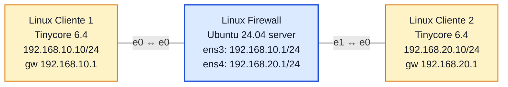

# Laboratório 10 - Firewall de Pacotes com `iptables`

**Disciplina:** ENE0025 - Protocolos de Transporte e Roteamento
**Professor responsável:** Prof. Dr. Laerte Peotta de Melo
**Monitores:** Victor Lima dos Santos / Beatriz Silva Nascimento

---

## Objetivo

Implementar um **firewall de pacotes (stateless)** em uma máquina Linux posicionada entre duas redes distintas, aplicando regras de `iptables` na cadeia `FORWARD` para controlar o tráfego com base em **IP de origem/destino, protocolo e porta**:

- liberar **ICMP** entre os dois clientes;
- liberar **HTTP (porta 80)** do Cliente 1 para o Cliente 2 (e o retorno);
- **bloquear Telnet (porta 23)**;
- negar implicitamente todo o resto (política padrão `DROP`).

---

## Topologia



### Print da topologia no PNetLab


| Dispositivo | Interface | Endereço IP | Gateway |
|---|---|---|---|
| Linux Cliente 1 | eth0 | 192.168.10.10/24 | 192.168.10.1 |
| Linux Firewall | ens3 (e0) | 192.168.10.1/24 | - |
| Linux Firewall | ens4 (e1) | 192.168.20.1/24 | - |
| Linux Cliente 2 | eth0 | 192.168.20.10/24 | 192.168.20.1 |

> **Desvio do enunciado:** o enunciado nomeia as interfaces do firewall como `eth0`/`eth1`, mas no Ubuntu 24.04 as interfaces aparecem como **`ens3`** (= `e0`) e **`ens4`** (= `e1`). A configuração foi feita sobre esses nomes reais.
>
> **Atenção (Erro cometido e posteriormente contornado):** o nó Firewall deve ser criado **já com `Ethernet: 2`** antes de desenhar os cabos. Alterar de 1 para 2 com os links já traçados deixa a fiação interna inconsistente, gerando os dois clientes no mesmo segmento L2. Esse erro foi cometido e fez com que a duração para finalizar esse Laboratório se extendesse a mais que 5 horas.

---

## Etapa 1 — Endereçamento

### Firewall (Ubuntu)

```bash
sudo ip addr add 192.168.10.1/24 dev ens3
sudo ip addr add 192.168.20.1/24 dev ens4
sudo ip link set ens3 up
sudo ip link set ens4 up
```

### Cliente 1 (Tinycore)

```bash
sudo ip addr add 192.168.10.10/24 dev eth0
sudo ip link set eth0 up
sudo ip route add default via 192.168.10.1
```

### Cliente 2 (Tinycore)

```bash
sudo ip addr add 192.168.20.10/24 dev eth0
sudo ip link set eth0 up
sudo ip route add default via 192.168.20.1
```

### Prints da configuração IP dos três hosts

<!-- Insira aqui o `ip addr` do Cliente 1 -->
<!-- Insira aqui o `ip addr` do Firewall -->
<!-- Insira aqui o `ip addr` do Cliente 2 -->

---

## Etapa 2 — Roteamento IP no firewall

```bash
sudo sysctl -w net.ipv4.ip_forward=1
cat /proc/sys/net/ipv4/ip_forward      # -> 1
```

Sem isso, o Linux não encaminha pacotes entre as duas redes e nada chega à cadeia `FORWARD`.

---

## Etapa 3 — Teste de bloqueio de ping via `sysctl` (no próprio firewall)

Demonstração de que `icmp_echo_ignore_all` afeta apenas o ICMP **destinado ao firewall**, não o encaminhamento entre redes.

```bash
sudo sysctl -w net.ipv4.icmp_echo_ignore_all=1   # firewall para de responder ping
# ...observação via tcpdump...
sudo sysctl -w net.ipv4.icmp_echo_ignore_all=0   # volta a responder
```

Com `=1`, o `tcpdump -i any -n icmp` no firewall mostra apenas os **echo request** entrando, sem nenhum **echo reply** saindo — o firewall ignora o ping a ele mesmo. Com `=0`, os replies voltam a aparecer.

### Print do tcpdump (com `=1`, só requests)


### Print do tcpdump (com `=0`, requests e replies)


---

## Etapa 4 — Teste de conectividade SEM firewall

Antes de aplicar regras, validação do roteamento ponta a ponta:

```bash
# Cliente 1
ping -c 3 192.168.20.10        # ok
# Cliente 2
ping -c 3 192.168.10.10        # ok
```

### Print do ping ponta a ponta


---

## Etapa 5 — Regras do firewall de pacotes

```bash
# limpeza e política padrão
sudo iptables -F
sudo iptables -X
sudo iptables -Z
sudo iptables -P FORWARD DROP

# ICMP nos dois sentidos
sudo iptables -A FORWARD -s 192.168.10.10 -d 192.168.20.10 -p icmp -j ACCEPT
sudo iptables -A FORWARD -s 192.168.20.10 -d 192.168.10.10 -p icmp -j ACCEPT

# HTTP (porta 80) do Cliente 1 para o Cliente 2 + retorno
sudo iptables -A FORWARD -s 192.168.10.10 -d 192.168.20.10 -p tcp --dport 80 -j ACCEPT
sudo iptables -A FORWARD -s 192.168.20.10 -d 192.168.10.10 -p tcp --sport 80 -j ACCEPT

# bloqueio explícito de Telnet (porta 23) - didático
sudo iptables -A FORWARD -s 192.168.10.10 -d 192.168.20.10 -p tcp --dport 23 -j DROP
```

> O retorno do HTTP usa `--sport 80` (a resposta do servidor sai **da** porta 80), não `--dport 80`. Como o firewall é stateless, o tráfego de volta precisa ser liberado explicitamente.

---

## Verificação das regras

### `sudo iptables -L -n -v` (após os testes)

```
Chain FORWARD (policy DROP 0 packets, 0 bytes)
 pkts bytes target  prot opt in out source         destination
    6   504 ACCEPT  icmp --  *  *  192.168.10.10   192.168.20.10
    6   504 ACCEPT  icmp --  *  *  192.168.20.10   192.168.10.10
    6   412 ACCEPT  tcp  --  *  *  192.168.10.10   192.168.20.10   tcp dpt:80
    5   268 ACCEPT  tcp  --  *  *  192.168.20.10   192.168.10.10   tcp spt:80
    6   360 DROP    tcp  --  *  *  192.168.10.10   192.168.20.10   tcp dpt:23
```

Os contadores `pkts` comprovam quantitativamente o casamento de cada regra: ICMP e HTTP passaram (ACCEPT incrementou), e as tentativas de Telnet foram descartadas (DROP com 6 pacotes).

### Print do `iptables -L -n -v`


---

## Testes práticos

### Teste 1 — ICMP (deve funcionar)

```bash
# Cliente 1 -> Cliente 2
ping -c 3 192.168.20.10        # responde
# Cliente 2 -> Cliente 1
ping -c 3 192.168.10.10        # responde
```


### Teste 2 — HTTP / porta 80 (deve funcionar)

Como o Tinycore não traz `python3` nem `busybox httpd`, o serviço foi simulado com `nc`:

```bash
# Cliente 2 (servidor)
nc -l -p 80
# Cliente 1 (cliente)
nc 192.168.20.10 80
```

A conexão é estabelecida e o texto digitado no Cliente 1 aparece no Cliente 2 — a porta 80 atravessa o firewall.


### Teste 3 — Telnet / porta 23 (deve falhar)

```bash
# Cliente 1
nc -vz -w 3 192.168.20.10 23
# -> Connection timed out
```

O `Connection timed out` (e não `Connection refused`) é a assinatura do `DROP`: o pacote é descartado em silêncio, sem resposta, e o cliente espera até o timeout.

<!-- Insira aqui o print do Telnet bloqueado (timed out) -->


## Questões para análise

1. **O que caracteriza um firewall de pacotes?** Filtra cada pacote isoladamente com base em campos do cabeçalho (IP, protocolo, porta), sem acompanhar o estado da conexão.

2. **Quais campos foram usados nas regras?** IP de origem (`-s`), IP de destino (`-d`), protocolo (`-p`) e porta (`--dport`/`--sport`).

3. **Por que ativar o IP forwarding?** Sem `ip_forward=1` o Linux não encaminha pacotes entre interfaces, então o tráfego entre as redes nem chega à cadeia `FORWARD`.

4. **Função da cadeia `FORWARD`?** Tratar o tráfego que **atravessa** o host (roteado entre interfaces), distinto de `INPUT`/`OUTPUT` (destinado/originado no próprio host).

5. **Por que o tráfego não permitido foi bloqueado sem regra específica?** Porque a política padrão da cadeia é `DROP`: o que não casa com nenhum `ACCEPT` é descartado ("nega tudo, libera o necessário").

6. **Diferença entre permitir HTTP e ICMP?** ICMP não tem portas (libera-se por protocolo). HTTP é TCP e exige liberar a porta 80 — e, por ser stateless, também o retorno (`--sport 80`).

7. **O que muda com a política `FORWARD DROP`?** Inverte a lógica para *whitelist*: nada passa por padrão, só o explicitamente permitido — postura mais segura.

8. **Por que ainda não é stateful?** Não há rastreamento de conexão (`conntrack`/`--state`). O retorno precisou ser autorizado manualmente; um firewall stateful liberaria a resposta automaticamente via `ESTABLISHED,RELATED`.

9. **Importância da ordem das regras?** O `iptables` avalia de cima para baixo e aplica a **primeira** que casa. Uma regra ampla antes de uma específica pode anular a segunda.

10. **Vantagens de hosts Linux básicos no lugar de VPCs?** Acesso real ao kernel (`sysctl`, `iptables`, `tcpdump`), shell completo para testes e visibilidade total do comportamento da pilha de rede.

11. **Bloquear ping via `sysctl` × via `iptables`?** O `icmp_echo_ignore_all` afeta só o ICMP **destinado ao próprio firewall** (cadeia local). O `iptables` na cadeia `FORWARD` controla o ICMP que **atravessa** o firewall entre as redes — escopos diferentes.

---

## Conclusão

O laboratório transformou uma máquina Ubuntu em **firewall de pacotes** entre duas redes, com `ip_forward` ativo e política `FORWARD DROP`. As regras liberaram ICMP e HTTP e bloquearam Telnet, e os contadores do `iptables -L -n -v` confirmaram o casamento de cada regra com o tráfego real: ping e porta 80 atravessaram, porta 23 foi descartada (timeout). O comportamento stateless ficou evidente na necessidade de liberar o tráfego de retorno explicitamente — gancho direto para o Lab 10-B (firewall stateful).
