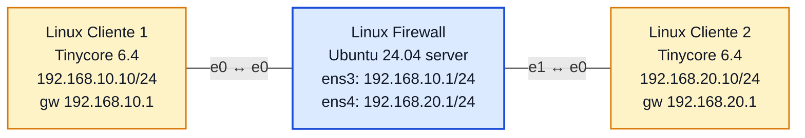

# Laboratório 10B - Firewall Stateful com `iptables`

**Disciplina:** ENE0025 - Protocolos de Transporte e Roteamento
**Professor responsável:** Prof. Dr. Laerte Peotta de Melo
**Monitores:** Victor Lima dos Santos / Beatriz Silva Nascimento

**Observação:** Continuação do **Laboratório 10**, reutilizando a mesma topologia e endereçamento.

---

## Objetivo

Evoluir o firewall de pacotes do Lab 10 para um modelo **stateful**, usando o rastreamento de conexões do kernel (`conntrack`). Em vez de escrever regras explícitas de ida **e** de volta, libera-se apenas o início da conexão (`NEW`) e deixa-se o retorno ser aceito automaticamente quando pertencer a uma sessão já estabelecida (`ESTABLISHED,RELATED`).

---

## Topologia



### Print da topologia no PNetLab


| Dispositivo | Interface | Endereço IP | Gateway |
|---|---|---|---|
| Linux Cliente 1 | eth0 | 192.168.10.10/24 | 192.168.10.1 |
| Linux Firewall | ens3 (e0) | 192.168.10.1/24 | - |
| Linux Firewall | ens4 (e1) | 192.168.20.1/24 | - |
| Linux Cliente 2 | eth0 | 192.168.20.10/24 | 192.168.20.1 |

> As interfaces do firewall aparecem como `ens3`/`ens4` (Ubuntu 24.04, *predictable names*), equivalentes ao `eth0`/`eth1` do enunciado.

---

## Pré-requisitos (herdados do Lab 10)

Endereçamento e roteamento já configurados. Confirmação no firewall:

```bash
ip -br addr
cat /proc/sys/net/ipv4/ip_forward      # -> 1
```

### Prints da configuração IP dos três hosts


---

## Conceitos de estado (`conntrack`)

| Estado | Significado |
|---|---|
| `NEW` | Pacote que **inicia** uma nova conexão |
| `ESTABLISHED` | Pacote de uma conexão **já aceita** anteriormente |
| `RELATED` | Pacote **relacionado** a uma conexão existente (ex.: erros ICMP, dados de FTP) |

O foco do lab é a diferença entre **NEW** e **ESTABLISHED**.

---

## Ruleset stateful

Substitui completamente as regras do Lab 10:

```bash
# limpeza e política padrão
sudo iptables -F
sudo iptables -X
sudo iptables -Z
sudo iptables -P FORWARD DROP

# regra central: todo retorno de conexão já aceita passa automaticamente
sudo iptables -A FORWARD -m conntrack --ctstate ESTABLISHED,RELATED -j ACCEPT

# apenas o INÍCIO das conexões do Cliente 1 -> Cliente 2
sudo iptables -A FORWARD -s 192.168.10.10 -d 192.168.20.10 -p icmp -m conntrack --ctstate NEW -j ACCEPT
sudo iptables -A FORWARD -s 192.168.10.10 -d 192.168.20.10 -p tcp --dport 80 -m conntrack --ctstate NEW -j ACCEPT
```

São **3 regras** (contra 5 no Lab 10): uma de retorno genérica e duas de início. Não há nenhuma regra de volta explícita — o `conntrack` cuida disso.

---
### Print das regras configuradas (counters zerados)


## Verificação das regras

### `sudo iptables -L -n -v` (após os testes)


```
$ sudo iptables -S
-P FORWARD DROP
-A FORWARD -m conntrack --ctstate RELATED,ESTABLISHED -j ACCEPT
-A FORWARD -s 192.168.10.10/32 -d 192.168.20.10/32 -p icmp -m conntrack --ctstate NEW -j ACCEPT
-A FORWARD -s 192.168.10.10/32 -d 192.168.20.10/32 -p tcp -m tcp --dport 80 -m conntrack --ctstate NEW -j ACCEPT
```

**Leitura dos contadores:** cada regra `NEW` casou apenas **1 pacote** (o primeiro de cada fluxo), enquanto a regra `ESTABLISHED,RELATED` casou **53** — todo o restante do tráfego (respostas de ping e de HTTP). É a assinatura do firewall stateful: só o pacote inicial é "novo"; os demais o kernel já reconhece como parte de uma conexão rastreada. Os **24 pacotes na política `DROP`** são as tentativas iniciadas pelo Cliente 2 e o Telnet — barrados por não terem regra `NEW`.

### Print do `iptables -L -n -v`


---

## Testes práticos

### Teste 1 — ICMP iniciado pelo Cliente 1 (deve funcionar)

```bash
# Cliente 1
ping -c 5 192.168.20.10        # responde (regra NEW + retorno ESTABLISHED)
```


### Teste 2 — ICMP iniciado pelo Cliente 2 (deve FALHAR)

```bash
# Cliente 2
ping 192.168.10.10             # 100% packet loss
```

O Cliente 2 não tem regra `NEW` e não há conexão estabelecida partindo dele, então a política `DROP` o barra. **Este é o teste que evidencia o stateful** — diferente do Lab 10, onde o ICMP era liberado explicitamente nos dois sentidos.


### Teste 3 — HTTP iniciado pelo Cliente 1 (deve funcionar)

Tinycore não traz `python3` nem `busybox httpd`; o serviço foi simulado com `nc`:

```bash
# Cliente 2 (servidor)
nc -l -p 80
# Cliente 1 (cliente)
nc 192.168.20.10 80
```

A conexão é estabelecida e os dados trafegam nos dois sentidos — **sem nenhuma regra de retorno explícita**, apenas pela regra `ESTABLISHED,RELATED`.

Client 2 ouvindo(e posteriormente recebendo as mensagens do client 1:


Client 1(conectado; envio das mensagens HTTP):


### Teste 4 — Nova conexão iniciada pelo Cliente 2 (deve falhar)

```bash
# Cliente 2
nc -vz -w 3 192.168.10.10 80   # Connection timed out
```


### Teste 5 — Telnet / porta 23 (deve falhar)

```bash
# Cliente 1
nc -vz -w 3 192.168.20.10 23   # Connection timed out
```

Não há regra `NEW` para a porta 23; a política `DROP` descarta em silêncio (timeout, não "refused").


---

## Comparação Lab 10 × Lab 10B

| Teste | Lab 10 — Filtro de pacotes | Lab 10B — Stateful |
|---|---|---|
| Ping iniciado pelo Cliente 1 | Funciona (regra de ida) | Funciona (`NEW`) |
| Retorno da comunicação | Regra explícita de volta | Automático (`ESTABLISHED,RELATED`) |
| HTTP Cliente 1 → Cliente 2 | Funciona (`--dport 80` **+** `--sport 80`) | Funciona (só `--dport 80 NEW`) |
| Nova conexão iniciada pelo Cliente 2 | Bloqueada | Bloqueada |
| Quantidade de regras (FORWARD) | 5 | 3 |
| Facilidade de administração | Menor — cada serviço exige par ida/volta | Maior — uma regra de retorno cobre tudo |

A diferença prática mais visível: no Lab 10 cada serviço liberado exigia **duas** regras (ida e volta); no Lab 10B, **uma** regra de retorno (`ESTABLISHED,RELATED`) serve para todos os serviços, e cada novo serviço precisa apenas de **uma** regra `NEW`.

---

## Questões para análise

1. **Stateful × filtro de pacotes?** O stateful acompanha o estado de cada conexão (via `conntrack`); o filtro simples avalia cada pacote isoladamente, sem memória da sessão.

2. **Função de `-m conntrack --ctstate ESTABLISHED,RELATED`?** Aceitar automaticamente pacotes que pertencem a conexões já aceitas (`ESTABLISHED`) ou relacionadas a elas (`RELATED`), dispensando regras de retorno.

3. **Por que o retorno do HTTP não precisou de regra inversa?** Porque o pacote inicial criou uma entrada no `conntrack`; as respostas do servidor casam como `ESTABLISHED` e são aceitas pela regra de retorno.

4. **O que caracteriza um pacote `NEW`?** É o primeiro pacote de um fluxo — aquele que inicia uma conexão ainda não registrada na tabela de rastreamento.

5. **Principal vantagem sobre o Lab 10?** Menos regras e mais legibilidade: não é preciso duplicar cada permissão para o sentido de volta.

6. **Por que o Cliente 2 não iniciou conexões?** Não existe regra `NEW` autorizando fluxos originados nele, e nada parte dele como `ESTABLISHED`; a política `DROP` o barra.

7. **O que mudou na quantidade/lógica das regras?** De 5 para 3 regras, e a lógica passou de "liberar ida e volta de cada serviço" para "liberar o início + uma única regra de retorno por estado".

8. **Onde o stateful é mais adequado?** Em redes reais com muitos serviços e tráfego bidirecional — servidores, gateways corporativos, NAT — onde regras de retorno manuais seriam inviáveis.

9. **O stateful elimina a política de bloqueio padrão?** Não. A política `DROP` continua essencial: ela barra o que não é `NEW` autorizado nem `ESTABLISHED`. Sem ela, o padrão `ACCEPT` deixaria tudo passar.

10. **O que a comparação tornou mais claro?** Que o resultado de conectividade é semelhante, mas o stateful chega lá com menos regras e uma política mais simples de manter — o retorno deixa de ser responsabilidade do administrador e passa a ser do kernel.

---

## Conclusão

O Lab 10B converteu o firewall de pacotes do Lab 10 em um firewall **stateful**. Com uma única regra `ESTABLISHED,RELATED` e regras `NEW` apenas no sentido de origem, obteve-se o mesmo controle de conectividade com menos regras: o ping e o HTTP iniciados pelo Cliente 1 funcionaram com retorno automático, enquanto qualquer conexão iniciada pelo Cliente 2 (e o Telnet) foi bloqueada. Os contadores — 1 pacote por regra `NEW` contra 53 na regra `ESTABLISHED` — evidenciaram na prática o rastreamento de conexões do kernel, confirmando o stateful como evolução natural do filtro de pacotes.
