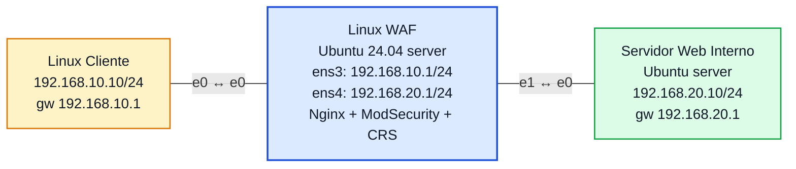

# Laboratório 11A - WAF com Nginx + ModSecurity + OWASP CRS

**Disciplina:** ENE0025 - Protocolos de Transporte e Roteamento
**Professor responsável:** Prof. Dr. Laerte Peotta de Melo
**Monitores:** Victor Lima dos Santos / Beatriz Silva Nascimento
**Tema:** Proteção de aplicações web com Web Application Firewall

**Observação:** Continuação dos Laboratórios 10 e 10B. A máquina intermediária deixa de ser um firewall de rede e passa a atuar como **firewall de aplicação (WAF)** em modo de **proxy reverso**.

---

## Objetivo

Implementar um **Web Application Firewall (WAF)** em uma máquina Linux, usando **Nginx + ModSecurity + OWASP Core Rule Set (CRS)** como **proxy reverso**, de modo que o tráfego HTTP entre o cliente e um servidor web interno seja inspecionado na **camada de aplicação**.

- **Nginx**: proxy reverso que recebe as requisições do cliente e as encaminha ao backend.
- **ModSecurity**: motor de WAF que inspeciona requisições/respostas HTTP.
- **OWASP CRS**: conjunto de regras prontas para detectar ataques web comuns (SQL Injection, XSS, path traversal, etc.).

---

## Topologia



### Print da topologia no PNetLab


| Dispositivo | Interface | Endereço IP | Gateway |
|---|---|---|---|
| Linux Cliente | eth0 | 192.168.10.10/24 | 192.168.10.1 |
| Linux WAF | ens3 (e0) | 192.168.10.1/24 | - |
| Linux WAF | ens4 (e1) | 192.168.20.1/24 | - |
| Servidor Web Interno | ens3 (e0) | 192.168.20.10/24 | 192.168.20.1 |

> As interfaces do WAF aparecem como `ens3`/`ens4` (Ubuntu 24.04, *predictable names*), equivalentes ao `eth0`/`eth1` do enunciado. O nó WAF deve ser criado já com **Ethernet: 2** (ou mais) antes de desenhar os cabos.

### Prints da configuração IP dos três hosts


---

## Relação com os Laboratórios 10 e 10B

| Tecnologia | Camada de atuação | Exemplo de decisão |
|---|---|---|
| Firewall de pacotes (Lab 10) | Rede / Transporte | Permitir ou bloquear TCP/80 |
| Firewall stateful (Lab 10B) | Rede / Transporte com estado | Permitir o retorno de uma conexão já estabelecida |
| WAF (Lab 11A) | Aplicação | Permitir o acesso à página, mas **bloquear a requisição maliciosa** |

A evolução é direta: o Lab 10 olhava IP/porta, o Lab 10B passou a olhar o estado da conexão, e o Lab 11A passa a **entender o conteúdo HTTP** — a porta 80 continua aberta, mas o conteúdo da requisição é analisado.

---

## Etapa 1 — Endereçamento e roteamento

### WAF (Ubuntu)

```bash
sudo ip addr add 192.168.10.1/24 dev ens3
sudo ip addr add 192.168.20.1/24 dev ens4
sudo ip link set ens3 up
sudo ip link set ens4 up
sudo sysctl -w net.ipv4.ip_forward=1
```

### Cliente

```bash
sudo ip addr add 192.168.10.10/24 dev eth0
sudo ip link set eth0 up
sudo ip route add default via 192.168.10.1
```

### Servidor Web Interno

```bash
sudo ip addr add 192.168.20.10/24 dev ens3
sudo ip link set ens3 up
sudo ip route add default via 192.168.20.1
```

Teste de conectividade (cliente → WAF e WAF → backend) com `ping` antes de seguir.

---

## Etapa 2 — Servidor web interno

Publicação de uma página simples na porta 80 do backend (servidor HTTP embutido do Python):

```bash
mkdir -p /tmp/web
echo "<h1>Servidor Web Interno OK</h1>" > /tmp/web/index.html
cd /tmp/web
sudo python3 -m http.server 80
```

O backend passa a responder em `192.168.20.10:80`. Esse terminal fica ocupado servindo as requisições.

---

## Etapa 3 — Instalação do WAF (no host intermediário)

```bash
sudo apt update
sudo apt install -y nginx libnginx-mod-http-modsecurity modsecurity-crs
```

Isso instala o Nginx, o módulo ModSecurity para Nginx (`libmodsecurity3`) e o OWASP CRS. O módulo já é habilitado automaticamente em `/etc/nginx/modules-enabled/50-mod-http-modsecurity.conf`.

> **Caminhos no Ubuntu 24.04 (diferem de guias genéricos):**
> - Configuração base do ModSecurity: `/etc/nginx/modsecurity.conf` (+ `/etc/nginx/unicode.mapping`)
> - CRS: `/etc/modsecurity/crs/crs-setup.conf` e regras em `/usr/share/modsecurity-crs/rules/`

---

## Etapa 4 — Ativação do ModSecurity

Coloca o motor em modo de bloqueio (de `DetectionOnly` para `On`):

```bash
sudo sed -i 's/SecRuleEngine DetectionOnly/SecRuleEngine On/' /etc/nginx/modsecurity.conf
grep SecRuleEngine /etc/nginx/modsecurity.conf      # -> SecRuleEngine On
```

### Print do `SecRuleEngine On`


---

## Etapa 5 — Arquivo principal de regras (`main.conf`)

```bash
sudo mkdir -p /etc/nginx/modsec
sudo tee /etc/nginx/modsec/main.conf > /dev/null <<'EOF'
Include /etc/nginx/modsecurity.conf
Include /etc/modsecurity/crs/crs-setup.conf
Include /usr/share/modsecurity-crs/rules/*.conf
EOF
```

> **Importante:** o conector do Nginx (`libmodsecurity3`) só entende a diretiva `Include` — **não** suporta `IncludeOptional` (usada pelo loader `owasp-crs.load`, que é do ModSecurity do Apache). Por isso o CRS é carregado apontando diretamente para `crs-setup.conf` e para `rules/*.conf`, em vez de incluir o `owasp-crs.load`.

---

## Etapa 6 — Nginx como proxy reverso com WAF

`/etc/nginx/sites-available/default`:

```nginx
server {
    listen 80 default_server;
    server_name _;

    modsecurity on;
    modsecurity_rules_file /etc/nginx/modsec/main.conf;

    location / {
        proxy_pass http://192.168.20.10;
        proxy_set_header Host $host;
        proxy_set_header X-Real-IP $remote_addr;
        proxy_set_header X-Forwarded-For $proxy_add_x_forwarded_for;
    }
}
```

---

## Etapa 7 — Teste de sintaxe e recarga

```bash
sudo nginx -t
sudo systemctl restart nginx
```

Saída esperada do `nginx -t`:

```
ModSecurity-nginx v1.0.3 (rules loaded inline/local/remote: 0/921/0)
nginx: configuration file /etc/nginx/nginx.conf syntax is ok
nginx: configuration file /etc/nginx/nginx.conf test is successful
```

As **921 regras do OWASP CRS** carregadas confirmam que o WAF está ativo.

### Print do `nginx -t`


---

## Testes funcionais

### Teste 1 — Acesso legítimo via WAF (deve funcionar)

No **Cliente** (o TinyCore não traz `curl`; usa-se `wget`):

```bash
wget -O - http://192.168.10.1
```

Resultado: o cliente recebe `<h1>Servidor Web Interno OK</h1>` — a página do backend, entregue **através do WAF**. O cliente fala com `192.168.10.1` (WAF) e nunca diretamente com o backend.

### Print do acesso do cliente via WAF


### Teste 2 — Log do backend (origem = WAF)

No terminal do **Servidor Web** aparece a requisição encaminhada pelo proxy:


A origem é **192.168.20.1** (interface `ens4` do WAF), não o IP do cliente — prova de que quem conversou com o backend foi o WAF, e não o cliente diretamente. É a característica do proxy reverso.

### Print do log do backend


### Teste 3 (bônus) — Requisição maliciosa (deve ser BLOQUEADA)

Demonstra a inspeção na camada de aplicação. Mesmo com a porta 80 aberta e a conexão TCP correta, o conteúdo é barrado pelo CRS:

```bash
# no Cliente (ou no WAF com curl)
curl "http://192.168.10.1/?x=<script>alert(1)</script>"
```

Resultado: **403 Forbidden** retornado pelo WAF, sem chegar ao backend. O evento do ModSecurity fica registrado no `error.log` do Nginx:

```bash
sudo tail -n 15 /var/log/nginx/error.log
```

Saída (resumida):

```
ModSecurity: Access denied with code 403 (phase 2). ... [id "949110"]
[msg "Inbound Anomaly Score Exceeded (Total Score: 18)"] [tag "OWASP_CRS/3.3.5"]
request: "GET /?x=<script>alert(1)</script> HTTP/1.1", host: "127.0.0.1"
```

O CRS opera em modo **anomaly scoring**: cada regra que casa soma pontos a um score; ao ultrapassar o limite (5), a regra de bloqueio **949110** retorna o 403. A requisição XSS somou score 18.

### Prints do bloqueio (403) e do log da regra


---

## Verificação de logs

```bash
# WAF - acessos do nginx (requisições legítimas)
sudo tail -n 5 /var/log/nginx/access.log

# WAF - eventos do ModSecurity (bloqueios do CRS)
sudo tail -n 15 /var/log/nginx/error.log
```

---

## Questões para análise

1. **O que caracteriza um WAF?** É um firewall de **camada de aplicação** que inspeciona o conteúdo HTTP/HTTPS (URL, parâmetros, cabeçalhos, corpo) e aplica regras voltadas à proteção de aplicações web, indo além de IP/porta/estado.

2. **Diferença entre WAF e firewall stateful?** O stateful decide com base em conexão e estado (camadas 3/4); o WAF entende o protocolo HTTP e o **conteúdo** da requisição (camada 7), podendo bloquear um ataque mesmo numa conexão válida.

3. **Por que o WAF é mais adequado para aplicações web?** Porque ataques como SQL Injection e XSS viajam dentro de requisições HTTP legítimas do ponto de vista de rede; só uma inspeção de conteúdo (L7) consegue detectá-los.

4. **Função do ModSecurity?** É o motor de inspeção: avalia cada requisição/resposta contra as regras carregadas e decide permitir, registrar ou bloquear.

5. **Função do OWASP CRS?** Fornecer um conjunto pronto e mantido de regras genéricas contra ataques web comuns, evitando escrever assinaturas do zero (aqui, 921 regras carregadas).

6. **O que é operar como proxy reverso?** O WAF recebe a requisição do cliente, a inspeciona e a **reencaminha** ao backend, devolvendo depois a resposta. O cliente acha que fala com a aplicação, mas fala primeiro com o WAF.

7. **Por que o acesso ao backend deve passar pelo WAF?** Para que todo o tráfego seja inspecionado num único ponto de entrada e o servidor interno fique oculto e menos exposto.

8. **Vantagens de separar cliente, WAF e backend em redes distintas?** Isola o servidor interno, centraliza a publicação e a segurança no WAF, e permite aplicar políticas sem alterar a aplicação.

9. **O WAF substitui o firewall de rede?** Não. Ele é **complementar**: o firewall de pacotes/stateful controla IP/porta/estado; o WAF controla o conteúdo HTTP. Defesa em profundidade usa os dois.

10. **Principal evolução conceitual entre 10, 10B e 11A?** Saiu-se de filtrar pacotes (L3/L4), para acompanhar conexões (estado), e finalmente para inspecionar a aplicação (L7) — cada camada adiciona uma defesa que a anterior não enxergava.

---

## Conclusão

O laboratório transformou a máquina intermediária em um **WAF reverso** com Nginx + ModSecurity + OWASP CRS. Com `SecRuleEngine On` e as 921 regras do CRS carregadas (confirmadas no `nginx -t`), o cliente passou a acessar o serviço pelo IP do WAF (`192.168.10.1`), que inspecionou o tráfego HTTP e o encaminhou ao backend (`192.168.20.10`) — comprovado pela página retornada ao cliente e pelo log do backend mostrando a origem `192.168.20.1` (o próprio WAF). Diferente dos Labs 10 e 10B, a proteção passou a ocorrer na **camada de aplicação**: a porta 80 segue aberta, mas o conteúdo da requisição agora é analisado, podendo um acesso de rede legítimo ser barrado por conter um padrão malicioso — gancho direto para o Lab 11B.
