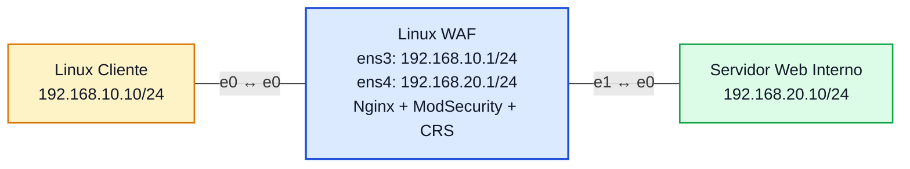

# Laboratório 11B - Testes de Ataques Web e Análise de Logs no WAF

**Disciplina:** ENE0025 - Protocolos de Transporte e Roteamento
**Professor responsável:** Prof. Dr. Laerte Peotta de Melo
**Monitores:** Victor Lima dos Santos / Beatriz Silva Nascimento
**Tema:** Validação prática de proteção web com WAF

**Aluno:** Henrique Izar -222026985

**Observação:** Continuação direta do **Laboratório 11A**, reutilizando o mesmo ambiente (Nginx + ModSecurity + OWASP CRS já configurados).

---

## Objetivo

Testar o WAF do Lab 11A com requisições HTTP **legítimas** e **maliciosas**, observando que:

- o tráfego normal passa;
- requisições com padrão de ataque são **bloqueadas (403)** mesmo com a porta 80 aberta;
- os bloqueios ficam registrados nos logs, associados a regras do OWASP CRS.

---

## Topologia (mesma do Lab 11A)



### Print da topologia no PNetLab


---

## Pré-requisitos

O ambiente do **Lab 11A** deve estar no ar:

- WAF com Nginx + ModSecurity + CRS, `SecRuleEngine On`;
- servidor web interno respondendo na porta 80;
- proxy reverso funcionando (acesso via `http://192.168.10.1`).

Confirmação rápida no WAF:

```bash
sudo nginx -t
sudo systemctl status nginx
```

---

## Como os testes foram executados

Os testes foram feitos no **WAF**, com `curl` apontando para `127.0.0.1` (passa pelo mesmo Nginx + ModSecurity do fluxo do cliente). Usou-se a opção abaixo para mostrar só o código HTTP de resposta:

```bash
curl -s -o /dev/null -w "%{http_code}\n" <url>
```

- `200` = requisição permitida (chegou ao backend)
- `403` = requisição bloqueada pelo WAF

> Nos testes com aspas (SQLi), o caractere `'` foi enviado **URL-encoded** como `%27`, para evitar problemas de digitação no console. Para o WAF, `%27` e `'` são equivalentes.

---

## Testes de tráfego legítimo

```bash
curl -s -o /dev/null -w "%{http_code}\n" http://127.0.0.1/
curl -s -o /dev/null -w "%{http_code}\n" "http://127.0.0.1/?id=10"
```

**Resultado:** ambos retornaram **200**. Requisições normais passam pelo WAF e são entregues pelo backend.

### Print dos testes legítimos (200)


---

## Testes de requisições maliciosas

```bash
# SQL Injection
curl -s -o /dev/null -w "SQLi: %{http_code}\n" "http://127.0.0.1/?id=1%27+OR+%271%27%3D%271"

# Cross-Site Scripting (XSS)
curl -s -o /dev/null -w "XSS: %{http_code}\n" "http://127.0.0.1/?q=<script>alert(1)</script>"

# Path Traversal / LFI (../../etc/passwd codificado)
curl -s -o /dev/null -w "LFI: %{http_code}\n" "http://127.0.0.1/?file=%2e%2e%2f%2e%2e%2fetc%2fpasswd"
```

**Resultado:** os três retornaram **403 Forbidden** — bloqueados pelo WAF antes de chegar ao backend.

### Prints dos testes maliciosos (403)


---

## Resumo dos resultados

| Teste | Requisição | Código | Comportamento |
|---|---|---|---|
| Página inicial | `GET /` | **200** | Permitido |
| Parâmetro simples | `?id=10` | **200** | Permitido |
| SQL Injection | `?id=1' OR '1'='1` | **403** | Bloqueado |
| XSS | `?q=<script>alert(1)</script>` | **403** | Bloqueado |
| Path Traversal | `?file=../../etc/passwd` | **403** | Bloqueado |

---

## Análise dos logs

No WAF, os bloqueios aparecem no `error.log` do Nginx:

```bash
sudo tail -n 20 /var/log/nginx/error.log
```

Saída (resumida):

```
ModSecurity: Access denied with code 403 (phase 2). ... [id "949110"]
[msg "Inbound Anomaly Score Exceeded (Total Score: 18)"] [tag "OWASP_CRS/3.3.5"]
request: "GET /?q=<script>alert(1)</script> HTTP/1.1"

ModSecurity: Access denied with code 403 (phase 2). ... [id "949110"]
[msg "Inbound Anomaly Score Exceeded (Total Score: 33)"] [tag "OWASP_CRS/3.3.5"]
request: "GET /?file=%2e%2e%2f%2e%2e%2fetc%2fpasswd HTTP/1.1"
```

**Leitura:** o CRS trabalha por **pontuação de anomalia** (*anomaly scoring*). Cada regra que casa soma pontos; quando o total passa do limite (5), a regra **949110** bloqueia com 403. O XSS somou 18 pontos e o path traversal somou 33 — quanto mais "suspeita" a requisição, maior o score.

### Print do log do ModSecurity (error.log)


### Log de acesso do Nginx

```bash
sudo tail -n 5 /var/log/nginx/access.log
```

Mostra as requisições recebidas (legítimas com 200, maliciosas com 403).


---

## Rede funcionando, aplicação bloqueada

A evidência central do laboratório: a conectividade de rede continua válida, mas a requisição maliciosa é barrada.

```bash
ping 192.168.10.1                 # rede OK
curl -I http://127.0.0.1          # porta 80 publicada (HTTP 200 na home)
curl ... "?q=<script>..."         # mesma porta, mas 403 pelo conteúdo
```

Ou seja: a porta 80 está aberta e a conexão TCP é estabelecida normalmente — mesmo assim a requisição é bloqueada **pelo conteúdo HTTP**, não pela rede.

---

## Tabela comparativa entre os modelos de firewall

| Situação | Firewall de pacotes | Firewall stateful | WAF |
|---|---|---|---|
| Liberar ou bloquear TCP/80 | Sim | Sim | Sim |
| Acompanhar conexão já estabelecida | Não | Sim | Indiretamente |
| Analisar conteúdo da URL | Não | Não | Sim |
| Identificar padrão de XSS | Não | Não | Sim |
| Identificar padrão de SQLi | Não | Não | Sim |
| Bloquear requisição web suspeita sem fechar a porta 80 | Não | Não | Sim |

---

## Questões para análise

1. **O que diferencia um WAF de um firewall stateful?** O stateful decide com base em conexão e estado (camadas 3/4); o WAF inspeciona o conteúdo HTTP (camada 7), podendo bloquear um ataque dentro de uma conexão válida.

2. **Por que a requisição pode ser bloqueada com a porta 80 aberta?** Porque o WAF não barra a porta nem a conexão — ele analisa o **conteúdo** da requisição. A porta aberta só garante que a conexão chega; o conteúdo é avaliado depois.

3. **O que o WAF observa que o `iptables` não observa?** A URL, os parâmetros, os cabeçalhos e o corpo da requisição HTTP — campos de aplicação que o `iptables` (IP/porta/estado) não enxerga.

4. **Comportamento diante de tráfego legítimo?** Permitido (200): a página inicial e o `?id=10` passaram normalmente e foram entregues pelo backend.

5. **Comportamento diante de tráfego suspeito?** Bloqueado (403): SQLi, XSS e path traversal foram barrados pelo WAF antes de chegar ao backend.

6. **O que os logs do Nginx mostram?** O `access.log` registra cada requisição (horário, origem, recurso, código HTTP); o `error.log` registra os bloqueios do ModSecurity.

7. **O que os logs do ModSecurity mostram?** A regra acionada (`id 949110`), a mensagem (anomaly score excedido), o score total, a versão do CRS e a requisição exata que foi bloqueada.

8. **Um bloqueio HTTP significa falha de rede?** Não. A rede está operacional, a conexão TCP é estabelecida e a porta 80 responde. O bloqueio é uma decisão de aplicação, não uma falha de conectividade.

9. **O WAF substitui a correção da vulnerabilidade na aplicação?** Não. Ele é uma camada de proteção que **reduz** a exposição, mas a falha continua no código. O ideal é corrigir a aplicação e manter o WAF como defesa adicional.

10. **Principal evidência de que o WAF atua na camada de aplicação?** Duas requisições na mesma porta 80, na mesma conexão TCP válida, tiveram destinos diferentes: a legítima retornou 200 e a maliciosa retornou 403 — a diferença foi só o **conteúdo**.

---

## Conclusão

O Lab 11B validou na prática o WAF montado no 11A. Com o ambiente intacto, requisições legítimas (`/` e `?id=10`) retornaram **200**, enquanto SQL Injection, XSS e path traversal retornaram **403**, bloqueados pelo OWASP CRS antes de chegar ao backend. Os logs do `error.log` confirmaram os eventos pela regra `949110` e pela pontuação de anomalia (18 e 33). A evidência principal ficou clara: com a mesma porta 80 aberta e a mesma conexão TCP válida, uma requisição é permitida e a outra é barrada — a decisão passou a depender do **conteúdo HTTP**, e não mais apenas de IP, porta ou estado da conexão. É a diferença prática entre **permitir a conexão** e **permitir a requisição**.
