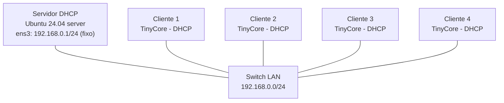

# Laboratório 13 - Configuração e Análise do Protocolo DHCP

**Disciplina:** ENE0025 - Protocolos de Transporte e Roteamento
**Professor responsável:** Prof. Dr. Laerte Peotta de Melo
**Monitores:** Victor Lima dos Santos / Beatriz Silva Nascimento
**Tema:** DHCP - Dynamic Host Configuration Protocol

---

## 1. Objetivo

Configurar um **servidor DHCP** em Linux e demonstrar a atribuição automática de endereços IPv4 a quatro clientes numa rede privada classe C (`192.168.0.0/24`), observando o processo **DORA** (Discover, Offer, Request, ACK) e as concessões (*leases*).

---

## 2. Topologia

Todos os dispositivos no mesmo segmento L2 (`192.168.0.0/24`), ligados por um switch.



### Print da topologia no PNetLab

<!-- Insira aqui o print da topologia -->

| Dispositivo | Interface | Endereço IP | Observação |
|---|---|---|---|
| Servidor DHCP | ens3 | 192.168.0.1/24 | IP estático |
| Cliente 1 a 4 | eth0 | DHCP | IP automático (faixa .100–.150) |

> No servidor (Ubuntu 24.04), a interface do lado da LAN aparece como `ens3` (*predictable names*), equivalente ao `eth0` do enunciado. O servidor possui ainda uma segunda interface (`ens4`) ligada à internet apenas para instalação do pacote, sem participar da rede DHCP.

---

## 3. Escopo DHCP

| Parâmetro | Valor |
|---|---|
| Rede | 192.168.0.0/24 |
| Faixa de distribuição | 192.168.0.100 – 192.168.0.150 |
| Gateway padrão | 192.168.0.1 |
| DNS | 8.8.8.8 |
| Lease padrão / máximo | 600 s / 3600 s |

---

## 4. Configuração do Servidor DHCP

### 4.1 IP estático no servidor

```bash
sudo ip addr add 192.168.0.1/24 dev ens3
sudo ip link set ens3 up
ip -br addr
```

Resultado esperado: `ens3   UP   192.168.0.1/24`.

### Print do `ip -br addr` no servidor

<!-- Insira aqui o print do ip -br addr do servidor -->

### 4.2 Instalação do serviço

```bash
sudo apt update
sudo apt install -y isc-dhcp-server
```

### 4.3 Definir a interface do serviço

Aponta o serviço para a interface da LAN (`ens3`):

```bash
sudo sed -i 's/INTERFACESv4=.*/INTERFACESv4=ens3/' /etc/default/isc-dhcp-server
grep INTERFACESv4= /etc/default/isc-dhcp-server      # -> INTERFACESv4=ens3
```

### 4.4 Escopo em `/etc/dhcp/dhcpd.conf`

Adicionado ao final do arquivo:

```conf
default-lease-time 600;
max-lease-time 3600;
authoritative;

subnet 192.168.0.0 netmask 255.255.255.0 {
    range 192.168.0.100 192.168.0.150;
    option routers 192.168.0.1;
    option subnet-mask 255.255.255.0;
    option domain-name-servers 8.8.8.8;
}
```

### Print do trecho do `dhcpd.conf`

<!-- Insira aqui o print do dhcpd.conf (tail) -->

### 4.5 Validação e início do serviço

```bash
sudo dhcpd -t -cf /etc/dhcp/dhcpd.conf        # sem erros
sudo systemctl restart isc-dhcp-server
sudo systemctl status isc-dhcp-server         # active (running)
```

---

## 5. Clientes DHCP

Os clientes são TinyCore Linux e solicitam IP automaticamente ao subir (via `udhcpc`). Para renovar/forçar manualmente em um cliente:

```bash
sudo udhcpc -i eth0
```

> No TinyCore o cliente DHCP é o `udhcpc` (BusyBox), equivalente ao `dhclient` citado no enunciado.

Verificação em cada cliente:

```bash
ip -br addr
ip route
cat /etc/resolv.conf
```

### Prints do `ip -br addr` dos quatro clientes

<!-- Insira aqui o print do ip -br addr do Cliente 1 -->
<!-- Insira aqui o print do ip -br addr do Cliente 2 -->
<!-- Insira aqui o print do ip -br addr do Cliente 3 -->
<!-- Insira aqui o print do ip -br addr do Cliente 4 -->

---

## 6. Resultado — endereços atribuídos

Os quatro clientes receberam endereços dentro da faixa configurada:

| Cliente | IP recebido | MAC | Estado |
|---|---|---|---|
| Cliente 1 | 192.168.0.100 | 50:30:d6:08:8b:00 | active |
| Cliente 2 | 192.168.0.101 | 50:77:e9:08:8a:00 | active |
| Cliente 3 | 192.168.0.102 | 50:e8:38:08:8c:00 | active |
| Cliente 4 | 192.168.0.103 | 50:bf:ba:08:89:00 | active |

---

## 7. Verificação das concessões (leases) no servidor

```bash
sudo cat /var/lib/dhcp/dhcpd.leases
```

Cada concessão registra o IP, o início/fim do lease, o MAC do cliente e o estado (`binding state active`):

```
lease 192.168.0.101 {
  starts 1 2026/07/13 19:09:55;
  ends 1 2026/07/13 19:19:55;
  binding state active;
  hardware ethernet 50:77:e9:08:8a:00;
  client-hostname "box";
}
```

### Print do `dhcpd.leases`

<!-- Insira aqui o print do dhcpd.leases -->

---

## 8. Evidência do processo DORA

O próprio log do serviço mostra a sequência DORA completa para cada cliente:

```bash
sudo systemctl status isc-dhcp-server
# ou
sudo journalctl -u isc-dhcp-server -n 20 --no-pager
```

Saída (exemplo real):

```
dhcpd: DHCPDISCOVER from 50:e8:38:08:8c:00 via ens3
dhcpd: DHCPOFFER on 192.168.0.102 to 50:e8:38:08:8c:00 (box) via ens3
dhcpd: DHCPREQUEST for 192.168.0.102 (192.168.0.1) from 50:e8:38:08:8c:00 via ens3
dhcpd: DHCPACK on 192.168.0.102 to 50:e8:38:08:8c:00 via ens3
```

- **DHCPDISCOVER** — o cliente procura um servidor DHCP;
- **DHCPOFFER** — o servidor oferece um IP;
- **DHCPREQUEST** — o cliente solicita o IP oferecido;
- **DHCPACK** — o servidor confirma a concessão.

### Print do log DORA

<!-- Insira aqui o print do log com DHCPDISCOVER/OFFER/REQUEST/ACK -->

> Opcionalmente, o mesmo processo pode ser capturado com `sudo tcpdump -i ens3 -n port 67 or port 68` enquanto um cliente renova o IP.

---

## 9. Teste de conectividade

De um cliente para o servidor e entre clientes:

```bash
ping -c 3 192.168.0.1      # cliente -> servidor
ping -c 3 192.168.0.101    # cliente -> outro cliente
```

### Print do teste de conectividade

<!-- Insira aqui o print do ping funcionando -->

---

## 10. Questões para fixação

1. **Função principal do DHCP?** Atribuir automaticamente endereços IP e parâmetros de rede (máscara, gateway, DNS) aos hosts, sem configuração manual.

2. **Por que facilita a administração?** Centraliza a configuração no servidor, elimina o trabalho manual host a host e evita erros como IPs duplicados.

3. **Quais informações o servidor entrega?** Endereço IP, máscara de sub-rede, gateway padrão, servidores DNS e o tempo de concessão (*lease*).

4. **O que é DORA?** A sequência de mensagens da obtenção de IP: **D**iscover (cliente procura), **O**ffer (servidor oferece), **R**equest (cliente pede) e **A**CK (servidor confirma).

5. **Quais portas UDP o DHCP usa?** UDP **67** (servidor) e UDP **68** (cliente).

6. **IP estático × dinâmico?** O estático é fixo e configurado manualmente; o dinâmico é concedido automaticamente pelo DHCP por um período (lease) e pode mudar.

7. **O que é o lease DHCP?** É o tempo pelo qual o IP fica concedido ao cliente. Ao expirar, o cliente renova ou o endereço volta ao pool.

8. **O que acontece se o servidor DHCP estiver desligado?** Novos clientes não recebem IP (o DHCPDISCOVER não é respondido) e ficam sem endereço válido (ou com IP de link-local `169.254.x.x`).

9. **Por que servidores usam IP fixo ou reserva?** Para terem endereço previsível e estável, essencial para serviços que outros hosts precisam localizar sempre no mesmo IP.

10. **Como o `tcpdump`/log ajuda?** Torna visível o processo DORA na prática (DISCOVER/OFFER/REQUEST/ACK), permitindo confirmar e depurar o funcionamento do DHCP.

---

## 11. Conclusão

Configurou-se um servidor DHCP (`isc-dhcp-server`) com IP estático `192.168.0.1` distribuindo endereços na faixa `192.168.0.100–150` da rede `192.168.0.0/24`. Os quatro clientes TinyCore receberam IPs automaticamente (`.100` a `.103`), confirmados tanto no arquivo de concessões (`dhcpd.leases`) quanto no log do serviço, que registrou o processo **DORA** completo para cada cliente. A prática mostrou que o DHCP reduz o esforço de configuração manual, evita erros de endereçamento e centraliza a administração dos parâmetros básicos de rede.
