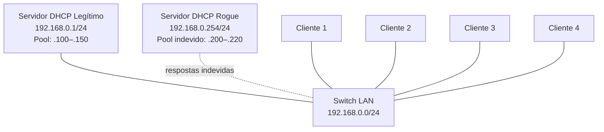

# Laboratório 13B - Segurança no DHCP: Servidor Falso, Análise e Mitigação

**Disciplina:** ENE0025 - Protocolos de Transporte e Roteamento
**Professor responsável:** Prof. Dr. Laerte Peotta de Melo
**Monitores:** Victor Lima dos Santos / Beatriz Silva Nascimento
**Tema:** Segurança no DHCP

**Observação:** Continuação direta do **Laboratório 13**, reutilizando o servidor DHCP legítimo e os quatro clientes.

---

## 1. Objetivo

Analisar os riscos de segurança do DHCP em redes locais: demonstrar, em ambiente isolado, o efeito de um **servidor DHCP não autorizado (rogue)** na mesma LAN, observar o impacto de gateway/DNS indevidos e discutir a mitigação por **DHCP Snooping**. Finalidade **didática e defensiva**.

---

## 2. Topologia

Mesma do Lab 13, acrescida de um segundo servidor Linux atuando como **rogue DHCP** (`192.168.0.254`).



### Print da topologia no PNetLab

<!-- Insira aqui o print da topologia (com o rogue) -->

| Dispositivo | IP | Função |
|---|---|---|
| Servidor DHCP legítimo | 192.168.0.1/24 | Entrega IPs válidos (.100–.150) |
| Servidor DHCP rogue | 192.168.0.254/24 | Resposta indevida (.200–.220) — ambiente controlado |
| Clientes 1–4 | DHCP | Recebem IP automaticamente |

---

## 3. Escopos DHCP

| Parâmetro | Servidor legítimo | Servidor rogue (indevido) |
|---|---|---|
| Servidor | 192.168.0.1 | 192.168.0.254 |
| Faixa | 192.168.0.100 – .150 | 192.168.0.200 – .220 |
| Gateway | 192.168.0.1 | **192.168.0.254** |
| DNS | 8.8.8.8 | **192.168.0.254** |

---

## 4. Configuração do servidor rogue

Segundo Linux (Ubuntu) na mesma LAN, com IP fixo `192.168.0.254`:

```bash
sudo ip addr add 192.168.0.254/24 dev ens3
sudo ip link set ens3 up
sudo apt install -y isc-dhcp-server
sudo sed -i 's/INTERFACESv4=.*/INTERFACESv4=ens3/' /etc/default/isc-dhcp-server
```

Escopo indevido em `/etc/dhcp/dhcpd.conf`:

```conf
default-lease-time 600;
max-lease-time 3600;
authoritative;

subnet 192.168.0.0 netmask 255.255.255.0 {
    range 192.168.0.200 192.168.0.220;
    option routers 192.168.0.254;
    option subnet-mask 255.255.255.0;
    option domain-name-servers 192.168.0.254;
}
```

```bash
sudo dhcpd -t -cf /etc/dhcp/dhcpd.conf      # sem erros
sudo systemctl restart isc-dhcp-server
```

### Print do `dhcpd.conf` do rogue

<!-- Insira aqui o print do dhcpd.conf do servidor rogue -->

---

## 5. Análise com `tcpdump` — dois servidores respondendo

Com os **dois** servidores ativos, captura no rogue enquanto um cliente renova:

```bash
sudo tcpdump -i ens3 -n port 67 or port 68
```

No cliente (TinyCore usa `udhcpc`):

```bash
sudo udhcpc -i eth0
```

Saída do `tcpdump` (real):

```
0.0.0.0.bootpc > 255.255.255.255.bootps: Request from 50:bf:ba:08:89:00   (DISCOVER)
192.168.0.1.bootps   > 192.168.0.103.bootpc: Reply                        (OFFER do LEGÍTIMO)
192.168.0.254.bootps > 192.168.0.200.bootpc: Reply                        (OFFER do ROGUE)
```

**Dois servidores DHCP** (`192.168.0.1` **e** `192.168.0.254`) respondem à mesma solicitação — exatamente o problema de segurança que o lab quer evidenciar.

### Print do `tcpdump` (dois servidores)

<!-- Insira aqui o print do tcpdump mostrando .1 e .254 respondendo -->

---

## 6. Cliente recebendo configuração indevida

Com o cliente pegando a oferta do rogue (garantido parando o legítimo por um instante):

```bash
sudo udhcpc -i eth0
ip addr show eth0
ip route
```

Resultado (real):

```
udhcpc: Lease of 192.168.0.201 obtained ...
adding dns 192.168.0.254
inet 192.168.0.201/24 ... eth0
default via 192.168.0.254 dev eth0
```

| Parâmetro | Legítimo (Lab 13) | Indevido (rogue) |
|---|---|---|
| IP | 192.168.0.10x | **192.168.0.201** |
| Gateway | 192.168.0.1 | **192.168.0.254** |
| DNS | 8.8.8.8 | **192.168.0.254** |

O cliente recebeu IP, **gateway e DNS falsos** — todo o seu tráfego de saída e as consultas DNS passariam pelo equipamento indevido.

### Print do cliente com configuração falsa

<!-- Insira aqui o print do udhcpc/ip route com gateway 192.168.0.254 -->

---

## 7. Impacto de gateway e DNS incorretos

- **Gateway falso (`192.168.0.254`)**: todo o tráfego que sai da rede passa pelo equipamento do atacante, que pode inspecionar, modificar ou redirecionar os pacotes (*man-in-the-middle*).
- **DNS falso (`192.168.0.254`)**: o atacante controla a resolução de nomes, podendo apontar sites legítimos para servidores maliciosos (phishing, captura de credenciais).
- Como a conexão de rede "funciona", o usuário dificilmente percebe — o diagnóstico é difícil.

---

## 8. Mitigação

### 8.1 Remoção do servidor não autorizado

Solução imediata no laboratório — desativar o rogue e renovar os clientes:

```bash
# no rogue
sudo systemctl stop isc-dhcp-server
sudo systemctl disable isc-dhcp-server
# no cliente
sudo udhcpc -i eth0        # volta a pegar .10x / gw .1 do legítimo
```

### 8.2 DHCP Snooping (defesa em switches gerenciáveis)

O **DHCP Snooping** é a defesa correta em produção. O switch classifica as portas:

| Porta | Descrição |
|---|---|
| **Trusted** | Só a do servidor DHCP legítimo (ou roteador) — pode enviar OFFER/ACK |
| **Untrusted** | Portas de usuário — o switch **descarta** mensagens DHCP de servidor (OFFER/ACK) vindas delas |

Assim, se um usuário conectar um servidor DHCP indevido numa porta untrusted, o switch bloqueia as respostas dele, e só o servidor legítimo (porta trusted) entrega configuração.

Exemplo conceitual (Cisco):

```cisco
ip dhcp snooping
ip dhcp snooping vlan 1
interface g0/1
 ip dhcp snooping trust        ! porta do servidor legítimo
interface range g0/2 - 24
 no ip dhcp snooping trust      ! portas de usuário (untrusted)
```

```cisco
show ip dhcp snooping
show ip dhcp snooping binding
```

> Nesta topologia o switch do PNetLab é simples (L2 básico), sem suporte a DHCP Snooping — por isso esta etapa é **conceitual**, conforme o próprio roteiro prevê.

---

## 9. Boas práticas de segurança

- Habilitar **DHCP Snooping** em switches gerenciáveis;
- marcar como **trusted** apenas a porta do servidor DHCP legítimo;
- segmentar a rede com **VLANs** (usuários, servidores, visitantes);
- monitorar logs e concessões do servidor DHCP;
- usar IP fixo/reserva para ativos críticos;
- combinar com **Dynamic ARP Inspection**, quando disponível.

---

## 10. Questões de análise

1. **O cliente recebeu endereço do legítimo ou do rogue?** Recebeu do **rogue** (`192.168.0.201`, gateway/DNS `192.168.0.254`) quando este venceu a disputa ou o legítimo estava parado.

2. **A porta untrusted bloquearia as respostas falsas?** Sim — com DHCP Snooping, o switch descartaria os OFFER/ACK do rogue por virem de porta untrusted. (Aqui o switch é simples, então a demonstração é conceitual.)

3. **Comando para ver estatísticas do snooping?** `show ip dhcp snooping statistics`.

4. **Por que servidores DHCP só em portas trusted?** Para que apenas fontes autorizadas possam entregar configuração de rede; qualquer outra porta é tratada como não confiável e tem as respostas DHCP bloqueadas.

5. **E se a porta do rogue fosse trusted por engano?** O switch passaria a aceitar as respostas falsas, e o ataque funcionaria normalmente — a proteção seria anulada.

---

## 11. Questões para fixação

1. **Por que o DHCP é um risco em redes locais?** Porque o cliente aceita a primeira resposta DHCP válida sem autenticar o servidor; qualquer equipamento na mesma LAN pode responder.

2. **O que é um servidor DHCP não autorizado?** Um servidor DHCP indevido (rogue), conectado à rede sem permissão, que entrega configurações incorretas ou maliciosas.

3. **Impacto de gateway incorreto?** O tráfego de saída passa pelo equipamento do atacante, que pode interceptar ou redirecionar (man-in-the-middle).

4. **Impacto de DNS malicioso?** A resolução de nomes fica sob controle do atacante, permitindo redirecionar domínios legítimos para servidores falsos (phishing).

5. **Como o `tcpdump` identifica múltiplos servidores?** Mostra as respostas (Reply/OFFER) partindo de mais de um IP de servidor (`192.168.0.1` e `192.168.0.254`) para a mesma solicitação.

6. **O que é DHCP Snooping?** Um mecanismo de switch gerenciável que filtra mensagens DHCP conforme a confiança da porta, bloqueando respostas de servidores em portas untrusted.

7. **Qual porta deve ser trusted?** Somente a que conecta o servidor DHCP legítimo (ou o roteador autorizado).

8. **Por que as portas dos clientes são untrusted?** Porque um cliente nunca deve agir como servidor DHCP; assim o switch descarta qualquer OFFER/ACK vindo dessas portas.

9. **Mitigar no servidor × no switch?** No servidor é reativo (desligar o rogue depois do problema); no switch é preventivo (o snooping impede a resposta falsa desde o início).

10. **Como VLANs ajudam?** Separam domínios de broadcast; um rogue numa VLAN não afeta clientes de outra, reduzindo o alcance do ataque.

---

## 12. Conclusão

O Lab 13B evidenciou o principal risco de segurança do DHCP: por não autenticar o servidor, o cliente pode aceitar configuração de um **servidor não autorizado** na mesma LAN. Com o rogue (`192.168.0.254`) ativo, o `tcpdump` mostrou os **dois servidores** respondendo à mesma solicitação, e um cliente chegou a receber IP `192.168.0.201` com **gateway e DNS falsos** (`192.168.0.254`) — abrindo caminho para interceptação de tráfego e DNS malicioso, mesmo com a rede aparentemente funcionando. A defesa adequada em produção é o **DHCP Snooping** (portas trusted/untrusted) combinado com segmentação por VLANs e monitoramento. O laboratório reforça que configurar um protocolo não basta: é preciso conhecer seus riscos e os mecanismos de proteção.
