# LAB 01

## Objetivos:
- Compreender que redes distintas não se comunicam automaticamente

- Identificar o papel do roteador como elemento lógico de interconexão

- Diferenciar falha de comunicação por ausência de roteamento de falha física

- Relacionar teoria de roteamento com comportamento real da rede

## Cenário

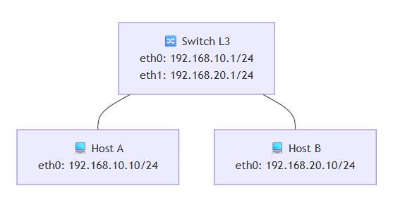

## Recursos
 - Router Cisco IOL (L3)
 - Linux (linux-tinycore-6.4)

## Procedimento

### Montagem da topologia

- Primeiro foram inseridos os nós dos Hosts A e B (linux-tinycore-6.4), o qual possui interface gráfica no PNetLab, e o nó do Router (Cisco IOL L3)

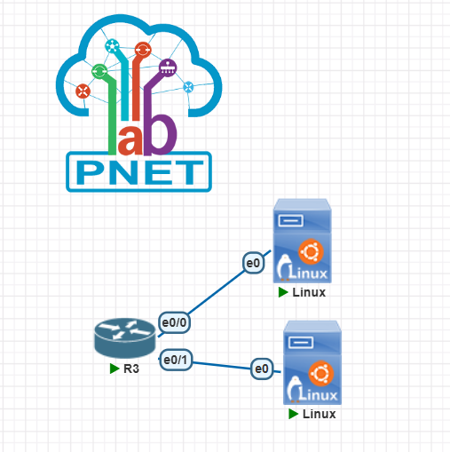

### Configuração de endereçamento IP

- Posteriormente, os dispositivos foram conectados às interfaces eth0/0 e eth0/1 do router, via interface gráfica do Linux, conforme as imagem a seguir

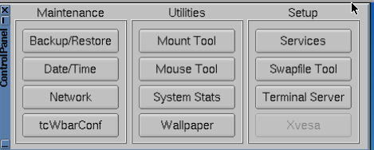

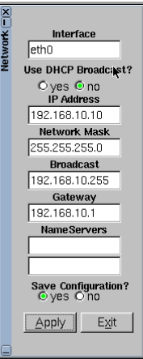

- E então foi necessária a configuração do Roteador:

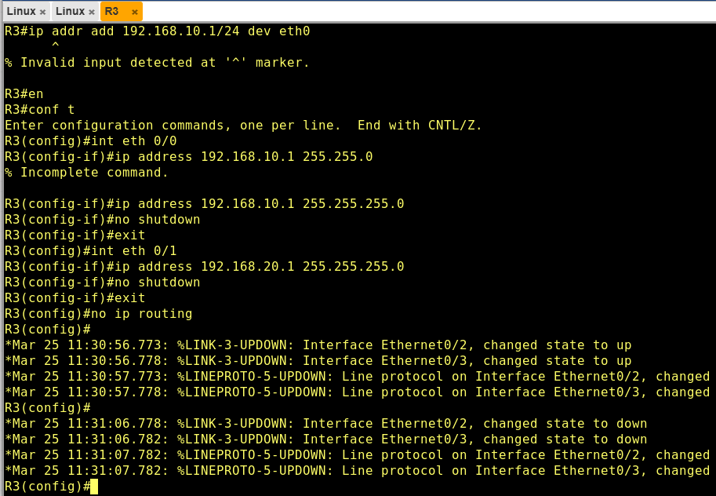

### Testes de conectividade (sem roteamento)

- A fim de confirmar se o procedimento foi feito corretamente, o comando "ping ["ip"]" foi executado

- Primeiro do Host A (192.168.10.10) para a subnet 192.168.20.10, a qual possui submáscara diferente (168.20.xx != 168.10.xx). E, conforme o esperado, houve falha:

- E, por fim, foi executado o ping do Host A para a interface do roteador, e o mesmo para o Host B:

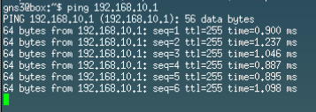

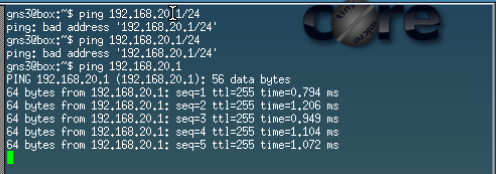

### Discussão

- O enlace físico funciona?
Sim
- O IP está configurado corretamente?
Sim
- Por que o pacote não chega ao Host B?
Da interface, o pacote não é direcionado ao Host B porque não há de fato a decisão de roteamento, a qual será implementada a seguir

### Introdução da decisão de roteamento

- Nesse momento foram configurados os gateways padrões nos hosts, com o comando
ip route add default via 192.168.xx.x

- Erro encontrado: Operation Not Permited. Esse erro de permissão foi facilmente contornado com o comando "sudo su", o qual viabiliza as permissões do admin (opera em root@)
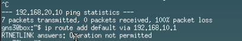

- Após isso, foi executado o comando novamente, mas então um outro erro, um pouco mais grave, ocorreu:
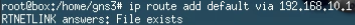

Após investigação, foi descoberto que esse erro tem como causa a *configuração do roteador*, a qual foi feita anteriormente, na seção  'Configuração de endereçamento IP'. 

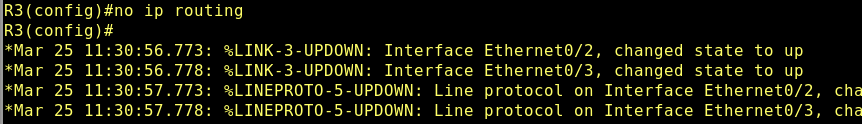

O roteador estava com o comando "no ip routing", o que, basicamente, faz com que o equipamento não funcione como roteador de camada 3, mesmo tendo várias interfaces configuradas com IP. Ou seja, quando o Host A  enviava um pacote para o Host B:

O pacote chegava ao roteador (gateway), mas o roteador *não* encaminhava para a outra interface, e o pacote era descartado.

- Apesar de o erro ter sido difícil de encontrar, a sua solução foi simples:
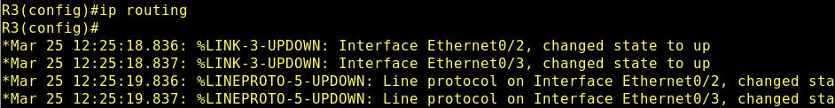

Com o comando "ip routing", a principal função do roteador foi ativada, que é a de encaminhamento de pacotes *entre redes diferentes* (roteamento)

- Dessa forma, o ping foi executado, e a operação foi bem sucedida:

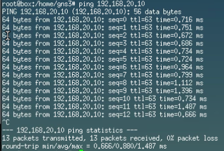

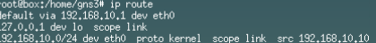

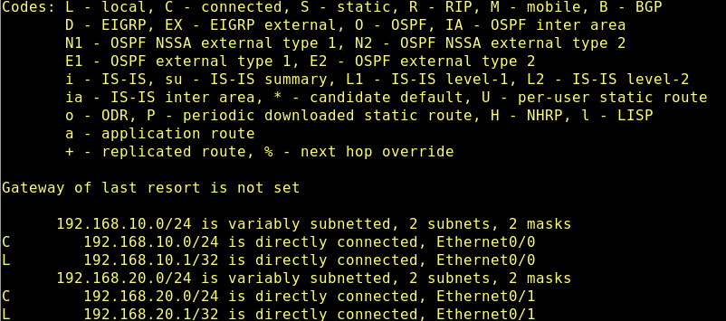

- Rotas diretamente conectadas
No Host A, existe apenas a rede:
192.168.10.0/24 → acessível diretamente
No roteador, existem duas redes diretamente conectadas:
192.168.10.0/24
192.168.20.0/24

Isso mostra que:

O roteador é o único dispositivo com conhecimento de ambas as redes, sendo responsável por interligá-las.